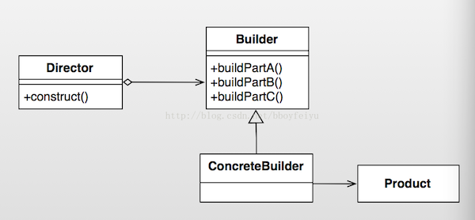
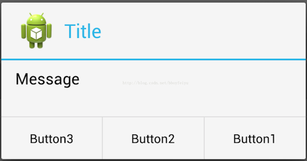

Android設計模式源碼解析之Builder模式 
====================================
> 本文為 [Android 設計模式源碼解析](https://github.com/simple-android-framework-exchange/android_design_patterns_analysis) 中 Builder模式 分析  
> Android系統版本： 2.3        
> 分析者：[Mr.Simple](https://github.com/bboyfeiyu)，分析狀態：完成，校對者：[Mr.Simple](https://github.com/bboyfeiyu)，校對狀態：完成   
 

## 1. 模式介紹  
 
###  模式的定義
將一個複雜對象的構建與它的表示分離，使得同樣的構建過程可以創建不同的表示。

### 模式的使用場景
1. 相同的方法，不同的執行順序，產生不同的事件結果時；   
2. 多個部件或零件，都可以裝配到一個對象中，但是產生的運行結果又不相同時；
3. 產品類非常複雜，或者產品類中的調用順序不同產生了不同的效能，這個時候使用建造者模式非常合適；
 

## 2. UML類圖
  

### 角色介紹
* Product 產品類 :  產品的抽象類。
* Builder : 抽象類， 規範產品的組建，一般是由子類實現具體的組件過程。
* ConcreteBuilder : 具體的構建器.
* Director : 統一組裝過程(可省略)。


## 3. 模式的簡單實現
###  簡單實現的介紹
電腦的組裝過程較為複雜，步驟繁多，但是順序卻是不固定的。下面我們以組裝電腦為例來演示一下簡單且經典的builder模式。

### 實現源碼

```java
package com.dp.example.builder;

/**
 * Computer產品抽象類, 為了例子簡單, 只列出這幾個屬性
 * 
 * @author mrsimple
 *
 */
public abstract class Computer {

	protected int mCpuCore = 1;
	protected int mRamSize = 0;
	protected String mOs = "Dos";

	protected Computer() {

	}

	// 設置CPU核心數
	public abstract void setCPU(int core);

	// 設置內存
	public abstract void setRAM(int gb);

	// 設置操作系統
	public abstract void setOs(String os);

	@Override
	public String toString() {
		return "Computer [mCpuCore=" + mCpuCore + ", mRamSize=" + mRamSize
				+ ", mOs=" + mOs + "]";
	}

}

package com.dp.example.builder;

/**
 * Apple電腦
 */
public class AppleComputer extends Computer {

	protected AppleComputer() {

	}

	@Override
	public void setCPU(int core) {
		mCpuCore = core;
	}

	@Override
	public void setRAM(int gb) {
		mRamSize = gb;
	}

	@Override
	public void setOs(String os) {
		mOs = os;
	}

}

package com.dp.example.builder;


package com.dp.example.builder;

/**
 * builder抽象類
 *
 */
public abstract class Builder {
	// 設置CPU核心數
	public abstract void buildCPU(int core);

	// 設置內存
	public abstract void buildRAM(int gb);

	// 設置操作系統
	public abstract void buildOs(String os);

	// 創建Computer
	public abstract Computer create();

}

package com.dp.example.builder;

public class ApplePCBuilder extends Builder {
	private Computer mApplePc = new AppleComputer();

	@Override
	public void buildCPU(int core) {
		mApplePc.setCPU(core);
	}

	@Override
	public void buildRAM(int gb) {
		mApplePc.setRAM(gb);
	}

	@Override
	public void buildOs(String os) {
		mApplePc.setOs(os);
	}

	@Override
	public Computer create() {
		return mApplePc;
	}

}

package com.dp.example.builder;

public class Director {
	Builder mBuilder = null;

	/**
	 * 
	 * @param builder
	 */
	public Director(Builder builder) {
		mBuilder = builder;
	}

	/**
	 * 構建對象
	 * 
	 * @param cpu
	 * @param ram
	 * @param os
	 */
	public void construct(int cpu, int ram, String os) {
		mBuilder.buildCPU(cpu);
		mBuilder.buildRAM(ram);
		mBuilder.buildOs(os);
	}
}

/**
 * 經典實現較為繁瑣
 * 
 * @author mrsimple
 *
 */
public class Test {
	public static void main(String[] args) {
		// 構建器
		Builder builder = new ApplePCBuilder();
		// Director
		Director pcDirector = new Director(builder);
		// 封裝構建過程, 4核, 內存2GB, Mac系統
		pcDirector.construct(4, 2, "Mac OS X 10.9.1");
		// 構建電腦, 輸出相關信息
		System.out.println("Computer Info : " + builder.create().toString());
	}
}
```    

通過Builder來構建產品對象, 而Director封裝了構建複雜產品對象對象的過程，不對外隱藏構建細節。


## Android源碼中的模式實現
在Android源碼中，我們最常用到的Builder模式就是AlertDialog.Builder， 使用該Builder來構建複雜的AlertDialog對象。簡單示例如下 : 

```java
    //顯示基本的AlertDialog  
    private void showDialog(Context context) {  
        AlertDialog.Builder builder = new AlertDialog.Builder(context);  
        builder.setIcon(R.drawable.icon);  
        builder.setTitle("Title");  
        builder.setMessage("Message");  
        builder.setPositiveButton("Button1",  
                new DialogInterface.OnClickListener() {  
                    public void onClick(DialogInterface dialog, int whichButton) {  
                        setTitle("點擊了對話框上的Button1");  
                    }  
                });  
        builder.setNeutralButton("Button2",  
                new DialogInterface.OnClickListener() {  
                    public void onClick(DialogInterface dialog, int whichButton) {  
                        setTitle("點擊了對話框上的Button2");  
                    }  
                });  
        builder.setNegativeButton("Button3",  
                new DialogInterface.OnClickListener() {  
                    public void onClick(DialogInterface dialog, int whichButton) {  
                        setTitle("點擊了對話框上的Button3");  
                    }  
                });  
        builder.create().show();  // 構建AlertDialog， 並且顯示
    } 
```

結果 : 
     

下面我們看看AlertDialog的相關源碼 :

```java
// AlertDialog
public class AlertDialog extends Dialog implements DialogInterface {
    // Controller, 接受Builder成員變量P中的各個參數
    private AlertController mAlert;

    // 構造函數
    protected AlertDialog(Context context, int theme) {
        this(context, theme, true);
    }

    // 4 : 構造AlertDialog
    AlertDialog(Context context, int theme, boolean createContextWrapper) {
        super(context, resolveDialogTheme(context, theme), createContextWrapper);
        mWindow.alwaysReadCloseOnTouchAttr();
        mAlert = new AlertController(getContext(), this, getWindow());
    }

    // 實際上調用的是mAlert的setTitle方法
    @Override
    public void setTitle(CharSequence title) {
        super.setTitle(title);
        mAlert.setTitle(title);
    }

    // 實際上調用的是mAlert的setCustomTitle方法
    public void setCustomTitle(View customTitleView) {
        mAlert.setCustomTitle(customTitleView);
    }
    
    public void setMessage(CharSequence message) {
        mAlert.setMessage(message);
    }

    // AlertDialog其他的代碼省略
    
    // ************  Builder為AlertDialog的內部類   *******************
    public static class Builder {
        // 1 : 存儲AlertDialog的各個參數, 例如title, message, icon等.
        private final AlertController.AlertParams P;
        // 屬性省略
        
        /**
         * Constructor using a context for this builder and the {@link AlertDialog} it creates.
         */
        public Builder(Context context) {
            this(context, resolveDialogTheme(context, 0));
        }


        public Builder(Context context, int theme) {
            P = new AlertController.AlertParams(new ContextThemeWrapper(
                    context, resolveDialogTheme(context, theme)));
            mTheme = theme;
        }
        
        // Builder的其他代碼省略 ......

        // 2 : 設置各種參數
        public Builder setTitle(CharSequence title) {
            P.mTitle = title;
            return this;
        }
        
        
        public Builder setMessage(CharSequence message) {
            P.mMessage = message;
            return this;
        }

        public Builder setIcon(int iconId) {
            P.mIconId = iconId;
            return this;
        }
        
        public Builder setPositiveButton(CharSequence text, final OnClickListener listener) {
            P.mPositiveButtonText = text;
            P.mPositiveButtonListener = listener;
            return this;
        }
        
        
        public Builder setView(View view) {
            P.mView = view;
            P.mViewSpacingSpecified = false;
            return this;
        }
        
        // 3 : 構建AlertDialog, 傳遞參數
        public AlertDialog create() {
            // 調用new AlertDialog構造對象， 並且將參數傳遞個體AlertDialog 
            final AlertDialog dialog = new AlertDialog(P.mContext, mTheme, false);
            // 5 : 將P中的參數應用的dialog中的mAlert對象中
            P.apply(dialog.mAlert);
            dialog.setCancelable(P.mCancelable);
            if (P.mCancelable) {
                dialog.setCanceledOnTouchOutside(true);
            }
            dialog.setOnCancelListener(P.mOnCancelListener);
            if (P.mOnKeyListener != null) {
                dialog.setOnKeyListener(P.mOnKeyListener);
            }
            return dialog;
        }
    }
    
}
``` 
可以看到，通過Builder來設置AlertDialog中的title, message, button等參數， 這些參數都存儲在類型為AlertController.AlertParams的成員變量P中，AlertController.AlertParams中包含了與之對應的成員變量。在調用Builder類的create函數時才創建AlertDialog, 並且將Builder成員變量P中保存的參數應用到AlertDialog的mAlert對象中，即P.apply(dialog.mAlert)代碼段。我們看看apply函數的實現 : 

```java
        public void apply(AlertController dialog) {
            if (mCustomTitleView != null) {
                dialog.setCustomTitle(mCustomTitleView);
            } else {
                if (mTitle != null) {
                    dialog.setTitle(mTitle);
                }
                if (mIcon != null) {
                    dialog.setIcon(mIcon);
                }
                if (mIconId >= 0) {
                    dialog.setIcon(mIconId);
                }
                if (mIconAttrId > 0) {
                    dialog.setIcon(dialog.getIconAttributeResId(mIconAttrId));
                }
            }
            if (mMessage != null) {
                dialog.setMessage(mMessage);
            }
            if (mPositiveButtonText != null) {
                dialog.setButton(DialogInterface.BUTTON_POSITIVE, mPositiveButtonText,
                        mPositiveButtonListener, null);
            }
            if (mNegativeButtonText != null) {
                dialog.setButton(DialogInterface.BUTTON_NEGATIVE, mNegativeButtonText,
                        mNegativeButtonListener, null);
            }
            if (mNeutralButtonText != null) {
                dialog.setButton(DialogInterface.BUTTON_NEUTRAL, mNeutralButtonText,
                        mNeutralButtonListener, null);
            }
            if (mForceInverseBackground) {
                dialog.setInverseBackgroundForced(true);
            }
            // For a list, the client can either supply an array of items or an
            // adapter or a cursor
            if ((mItems != null) || (mCursor != null) || (mAdapter != null)) {
                createListView(dialog);
            }
            if (mView != null) {
                if (mViewSpacingSpecified) {
                    dialog.setView(mView, mViewSpacingLeft, mViewSpacingTop, mViewSpacingRight,
                            mViewSpacingBottom);
                } else {
                    dialog.setView(mView);
                }
            }
        }
```
實際上就是把P中的參數挨個的設置到AlertController中， 也就是AlertDialog中的mAlert對象。從AlertDialog的各個setter方法中我們也可以看到，實際上也都是調用了mAlert對應的setter方法。在這裡，Builder同時扮演了上文中提到的builder、ConcreteBuilder、Director的角色，簡化了Builder模式的設計。       


## 4. 雜談
### 優點與缺點
#### 優點  
* 良好的封裝性， 使用建造者模式可以使客戶端不必知道產品內部組成的細節；
* 建造者獨立，容易擴展；
* 在對象創建過程中會使用到系統中的一些其它對象，這些對象在產品對象的創建過程中不易得到。

#### 缺點 
* 會產生多餘的Builder對象以及Director對象，消耗內存；
* 對象的構建過程暴露。 
