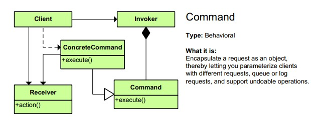
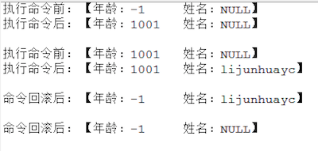

Android設計模式源碼解析之命令模式 
====================================
> 本文為 [Android 設計模式源碼解析](https://github.com/simple-android-framework-exchange/android_design_patterns_analysis) 中 命令模式 分析  
> Android系統版本： 2.3        
> 分析者：[lijunhuayc](https://github.com/lijunhuayc)，分析狀態：完成，校對者：[Mr.Simple](https://github.com/bboyfeiyu)，校對狀態：未開始   

## 1. 模式介紹  
 
###  模式的定義
將一個請求封裝成一個對象，從而使你可用不同的請求對客戶進行參數化，對請求排隊或記錄請求日誌，以及支持可撤銷的操作。

### 模式的使用場景
1. 系統需要將請求調用者和請求接收者解耦，使得調用者和接收者不直接交互。
2. 系統需要在不同的時間指定請求、將請求排隊和執行請求。
3. 系統需要支持命令的撤銷(Undo)操作和恢復(Redo)操作。
4. 系統需要將一組操作組合在一起，即支持宏命令。

## 2. UML類圖
 


### 角色介紹
* 命令角色（Command）：定義命令的接口，聲明具體命令類需要執行的方法。這是一個抽象角色。

* 具體命令角色（ConcreteCommand）：命令接口的具體實現對象，通常會持有接收者，並調用接收者的功能來完成命令要執行的操作。

* 調用者角色（Invoker）：負責調用命令對象執行請求，通常會持有命令對象（可以持有多個命令對象）。Invoker是Client真正觸發命令並要求命令執行相應操作的地方（使用命令對象的入口）。

* 接受者角色（Receiver）：Receiver是真正執行命令的對象。任何類都可能成為一個接收者，只要它能夠實現命令要求實現的相應功能。

* 客戶角色（Client）：Client可以創建具體的命令對象，並且設置命令對象的接收者。Tips：不能把Clinet理解為我們平常說的客戶端，這裡的Client是一個組裝命令對象和接受者對象的角色，或者你把它理解為一個裝配者。

## 3. 模式的簡單實現
###  簡單實現的介紹
命令模式其實就是對命令進行封裝，將命令請求者和命令執行者的責任分離開來實現鬆耦合。
這裡我們通過一個簡單的實例來剖析一下命令模式：命令接收者ReceiverRole擁有一個PeopleBean類型成員，通過Invoker發出不同的命令來修改PeopleBean的相對應的屬性，具體命令實現類ConcreteCommandImpl1執行修改年齡命令，ConcreteCommandImpl2執行修改姓名的命令等等，ClientRole負責組裝各個部分。
例子代碼如下（resource目錄下也可以查看）。

### 實現源碼

```java
    package com.command;
    /**
     * 命令接口    [命令角色]
     */
    public interface Command {
    	public void execute();
    	public void undo();
    	public void redo();
    }
    
```

ConcreteCommandImpl1.java類.     


```java    

    package com.command;
    /**
     * 更新年齡的命令類  [ 具體命令角色 ]
     */
    public class ConcreteCommandImpl1 implements Command{
    	private ReceiverRole receiverRole1;
    
    	public ConcreteCommandImpl1(ReceiverRole receiverRole1) {
    		this.receiverRole1 = receiverRole1;
    	}
    	
    	@Override
    	public void execute() {
    		/*
    		 * 可以加入命令排隊等等，未執行的命令支持redo操作
    		 */
    		receiverRole1.opActionUpdateAge(1001);//執行具體的命令操作
    	}
    
    	@Override
    	public void undo() {
    		receiverRole1.rollBackAge();//執行具體的撤銷回滾操作
    	}
    
    	@Override
    	public void redo() {
    		//在命令執行前可以修改命令的執行
    	}
    }
```

ConcreteCommandImpl2.java類.    

```java
    package com.command;
    /**
     * 更新姓名的命令類[具體命令角色]
     */
    public class ConcreteCommandImpl2 implements Command{
    	private ReceiverRole receiverRole1;
    
    	public ConcreteCommandImpl2(ReceiverRole receiverRole1) {
    		this.receiverRole1 = receiverRole1;
    	}
    	
    	@Override
    	public void execute() {
    		/*
    		 * 可以加入命令排隊等等，未執行的命令支持redo操作
    		 */
    		receiverRole1.opActionUpdateName("lijunhuayc");//執行具體的命令操作
    	}
    
    	@Override
    	public void undo() {
    		receiverRole1.rollBackName();//執行具體的撤銷回滾操作
    	}
    
    	@Override
    	public void redo() {
    		//在命令執行前可以修改命令的執行
    	}
    	
    }
```

InvokerRole.java.      

```java
    package com.command;
    /**
     * 命令調用[調用者角色]
     */
    public class InvokerRole {
    	private Command command1;
    	private Command command2;
    	//持有多個命令對象[實際的情況也可能是一個命令對象的集合來保存命令對象]
    	
    	public void setCommand1(Command command1) {
    		this.command1 = command1;
    	}
    	public void setCommand2(Command command2) {
    		this.command2 = command2;
    	}
    	
    	/**
    	 * 執行正常命令，1執行回滾命令
    	 */
    	public void invoke(int args) {
    		//可以根據具體情況選擇執行某些命令
    		if(args == 0){
    			command1.execute();
    			command2.execute();
    		}else if(args == 1){
    			command1.undo();
    			command2.undo();
    		}
    	}
    	
    }
```

ReceiverRole.java.    

```java
    package com.command;
    /**
     * 命令的具體執行類[接收者角色], 命令接收者可以是任意的類，只要實現了命令要求實現的相應功能即可。
     */
    public class ReceiverRole {
    	private PeopleBean people;
    	//具體命令操作的緩存棧，用於回滾。這裡為了方便就用一個PeopleBean來代替    
    	private PeopleBean peopleCache = new PeopleBean();     	public ReceiverRole() {
    		this.people = new PeopleBean(-1, "NULL");//初始化年齡為-1，姓名為NULL
    	}
    	
    	public ReceiverRole(PeopleBean people) {
    		this.people = people;
    	}
	
	/**
	 * 具體操作方法[修改年齡和姓名]
	 */
	public void opActionUpdateAge(int age) {
		System.out.println("執行命令前："+people.toString());
		this.people.update(age);
		System.out.println("執行命令後："+people.toString()+"\n");
	}
	
	//修改姓名
	public void opActionUpdateName(String name) {
		System.out.println("執行命令前："+people.toString());
		this.people.update(name);
		System.out.println("執行命令後："+people.toString()+"\n");
	}
	
	/**
	 * 回滾操作，用於撤銷opAction執行的改變
	 */
	public void rollBackAge() {
		people.setAge(peopleCache.getAge());
		System.out.println("命令回滾後："+people.toString()+"\n");
	}
	public void rollBackName() {
		people.setName(peopleCache.getName());
		System.out.println("命令回滾後："+people.toString()+"\n");
	}
}
```

PeopleBean.java     

```java
    package com.command;
    /**
     * @Desc: 輔助類，作為接收者Receiver的成員，包含兩個屬性，用來觀察命令的執行情況
     * @author ljh
     * @date 2015-3-16 上午11:29:11
     */
    public class PeopleBean {
    	private int age = -1;	//年齡
    	private String name = "NULL";	//姓名
    	public PeopleBean() {
    	}
    	public PeopleBean(int age, String name) {
    		this.age = age;
    		this.name = name;
    	}
    	public void update(int age, String name) {
    		this.age = age;
    		this.name = name;
    	}
    	public void update(int age) {
    		this.age = age;
    	}
    	public void update(String name) {
    		this.name = name;
    	}
    	/**
    	 * @return 返回一個PeopleBean的克隆對象
    	 */
    	protected PeopleBean clone(){
    		return new PeopleBean(age, name);
    	}
    	@Override
    	public String toString() {
    		return " 【年齡：" + age + "\t姓名：" + name + "】";
    	}
    	// setter and getter 
    	
    }
```     

ClientRole.java    

```java
    package com.command;
    /**
     * 命令對象和接受者對象的組裝類[客戶角色].
     * 我這把類名定義成ClientRole更方便讀者理解這只是命令模式中的一個客戶角色，而不是我們常規意義上說的客戶端
     */
    public class ClientRole {
    	/**
    	 * 組裝操作
    	 */
    	public void assembleAction() {
    		//創建一個命令接收者
    		ReceiverRole receiverRole1 = new ReceiverRole();    			//創建一個命令的具體實現對象，並指定命令接收者
    		Command command1 = new ConcreteCommandImpl1(receiverRole1);           		    Command command2 = new ConcreteCommandImpl2(receiverRole1);
    
    		InvokerRole invokerRole = new InvokerRole();//創建一個命令調用者
    		invokerRole.setCommand1(command1);//為調用者指定命令對象1
    		invokerRole.setCommand2(command2);//為調用者指定命令對象2
    		invokerRole.invoke(0);				//發起調用命令請求
    		invokerRole.invoke(1);				//發起調用命令請求
    	}
    }
```

測試類.    

```java
    package com.command;

    public class MainTest {
    	public static void main(String[] args) {
    		ClientRole client = new ClientRole();
    		client.assembleAction();
    	}
    }
```

輸出結果如下：       



### 總結
* 每一個命令都是一個操作：請求的一方發出請求，要求執行一個操作；接收的一方收到請求，並執行操作。
* 命令模式允許請求的一方和接收的一方獨立開來，使得請求的一方不必知道接收請求的一方的接口，更不必知道請求是怎麼被接收，以及操作是否被執行、何時被執行，以及是怎麼被執行的。
* 命令模式使請求本身成為一個對象，這個對象和其他對象一樣可以被存儲和傳遞。
* 命令模式的關鍵在於引入了抽象命令接口，且發送者針對抽象命令接口編程，只有實現了抽象命令接口的具體命令才能與接收者相關聯。

## Android源碼中的模式實現
Command接口中定義了一個execute方法，客戶端通過Invoker調用命令操作再來調用Recriver執行命令；把對Receiver的操作請求封裝在具體的命令中，使得命令發起者和命令接收者解耦。
以Android中大家常見的Runnable為例：客戶端只需要new Thread(new Runnable(){}).start()就開始執行一系列相關的請求，這些請求大部分都是實現Runnable接口的匿名類。
【O_o 模式就在我們身邊~】

命令接口Runnable接口定義如下：    

```
package java.lang;
/**
 * Represents a command that can be executed. Often used to run code in a
 * different {@link Thread}.
 */
public interface Runnable {

    /**
     * Starts executing the active part of the class' code. This method is
     * called when a thread is started that has been created with a class which
     * implements {@code Runnable}.
     */
    public void run();
}
```

調用者Thread源碼如下（省略部分代碼）：
Tips：命令模式在這裡本來不需要繼承Runnable接口，但為了方便性等，繼承了Runnable接口實現了run方法，這個run是Thread自身的運行run的方法，而不是命令Runnable的run。    

```
public class Thread implements Runnable {
    //省略部分無關代碼...
    /* some of these are accessed directly by the VM; do not rename them */
    volatile VMThread vmThread;
    volatile ThreadGroup group;
    volatile boolean daemon;
    volatile String name;
    volatile int priority;
    volatile long stackSize;
    Runnable target;
    private static int count = 0;
    
    public synchronized void start() {
        if (hasBeenStarted) {
            throw new IllegalThreadStateException("Thread already started."); // TODO Externalize?
        }

        hasBeenStarted = true;

        VMThread.create(this, stackSize);
    }
    //省略部分代碼...
}
```    

上面可以看到執行start()方法的時候實際執行了VMThread.create(this, stackSize)方法；create是VMThread的本地方法，其JNI實現在 android/dalvik/vm/native/java_lang_VMThread.cpp 中的 Dalvik_java_lang_VMThread_create方法，如下：      

```
static void Dalvik_java_lang_VMThread_create(const u4* args, JValue* pResult)
{
    Object* threadObj = (Object*) args[0];
    s8 stackSize = GET_ARG_LONG(args, 1);

    /* copying collector will pin threadObj for us since it was an argument */
    dvmCreateInterpThread(threadObj, (int) stackSize);
    RETURN_VOID();
}
```    

而dvmCreateInterpThread的實現在Thread.app中，如下：    

```
bool dvmCreateInterpThread(Object* threadObj, int reqStackSize){
    Thread* self = dvmThreadSelf();
    
    Thread* newThread = allocThread(stackSize); 
    newThread->threadObj = threadObj;
    
    Object* vmThreadObj = dvmAllocObject(gDvm.classJavaLangVMThread, ALLOC_DEFAULT);
    dvmSetFieldInt(vmThreadObj, gDvm.offJavaLangVMThread_vmData, (u4)newThread);
    dvmSetFieldObject(threadObj, gDvm.offJavaLangThread_vmThread, vmThreadObj);
    
    pthread_t threadHandle;
    int cc = pthread_create(&threadHandle, &threadAttr, interpThreadStart, newThread);

    dvmLockThreadList(self);

    assert(newThread->status == THREAD_STARTING);
    newThread->status = THREAD_VMWAIT;
    pthread_cond_broadcast(&gDvm.threadStartCond);

    dvmUnlockThreadList();
    
}

static Thread* allocThread(int interpStackSize)
{
    Thread* thread;
    thread = (Thread*) calloc(1, sizeof(Thread));
    
    thread->status = THREAD_INITIALIZING;
}
```   

這裡是底層代碼，簡單介紹下就行了：
第4行通過調用 allocThread 創建一個名為newThread的dalvik Thread並設置一些屬性，第5行設置其成員變量threadObj為傳入的Android Thread，這樣dalvik Thread就與Android Thread對象關聯起來了；第7行然後創建一個名為vmThreadObj的VMThread對象，設置其成員變量vmData為前面創建的newThread，設置 Android Thread threadObj的成員變量vmThread為這個vmThreadObj，這樣Android Thread通過VMThread的成員變量vmData就和dalvik Thread關聯起來了。       

接下來在12行通過pthread_create創建pthread線程，並讓這個線程start，這樣就會進入該線程的thread entry運行，下來我們來看新線程的thread entry方法 interpThreadStart，同樣只列出關鍵的地方：

```
//pthread entry function for threads started from interpreted code.
static void* interpThreadStart(void* arg){
    Thread* self = (Thread*) arg;
    std::string threadName(dvmGetThreadName(self));
    setThreadName(threadName.c_str());

    //Finish initializing the Thread struct.
    dvmLockThreadList(self);
    prepareThread(self);

    while (self->status != THREAD_VMWAIT)
        pthread_cond_wait(&gDvm.threadStartCond, &gDvm.threadListLock);

    dvmUnlockThreadList();

    /*
     * Add a JNI context.
     */
    self->jniEnv = dvmCreateJNIEnv(self);

    //修改狀態為THREAD_RUNNING
    dvmChangeStatus(self, THREAD_RUNNING);
    
    //執行run方法
    Method* run = self->threadObj->clazz->vtable[gDvm.voffJavaLangThread_run];

    JValue unused;
    ALOGV("threadid=%d: calling run()", self->threadId);
    assert(strcmp(run->name, "run") == 0);
    dvmCallMethod(self, run, self->threadObj, &unused);
    ALOGV("threadid=%d: exiting", self->threadId);
    
    //移出線程並釋放資源
    dvmDetachCurrentThread();
    return NULL;
}

//Finish initialization of a Thread struct.
static bool prepareThread(Thread* thread){
    assignThreadId(thread);
    thread->handle = pthread_self();
    thread->systemTid = dvmGetSysThreadId();
    setThreadSelf(thread);
    return true;
}

//Explore our sense of self.  Stuffs the thread pointer into TLS.
static void setThreadSelf(Thread* thread){
    int cc;
    cc = pthread_setspecific(gDvm.pthreadKeySelf, thread);
}
```    

在新線程的interpThreadStart方法中，首先設置線程的名字，然後調用prepareThread設置線程id以及其它一些屬性，其中調用了setThreadSelf將新dalvik Thread自身保存在TLS中，這樣之後就能通過dvmThreadSelf方法從TLS中獲取它。然後在29行處修改狀態為THREAD_RUNNING，並在36行調用對應Android Thread的run()方法，其中調用了Runnable的run方法，運行我們自己的代碼。
繞這麼深才執行到我們的run方法，累不累？ v_v      

```
    /**
     * Calls the <code>run()</code> method of the Runnable object the receiver
     * holds. If no Runnable is set, does nothing.
     * @see Thread#start
     */
    public void run() {
        if (target != null) {
            target.run();
        }
    }
```   

到此我們已經完成一次命令調用，至於底層run調用完畢後續執行代碼，讀者可以自行跟進看看~~~


## 4. 雜談
###優點與缺點
####優點
1. 降低對象之間的耦合度。
2. 新的命令可以很容易地加入到系統中。
3. 可以比較容易地設計一個組合命令。
4. 調用同一方法實現不同的功能

####缺點
使用命令模式可能會導致某些系統有過多的具體命令類。因為針對每一個命令都需要設計一個具體命令類，因此某些系統可能需要大量具體命令類，這將影響命令模式的使用。       
比如上面的PeopleBean的屬性增加，Receiver針對PeopleBean一個屬性一個執行方法，一個Command的實現可以調用Receiver的一個執行方法，由此得需要設計多少個具體命令類呀！！
