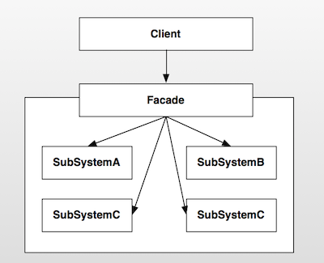
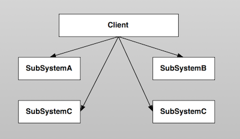
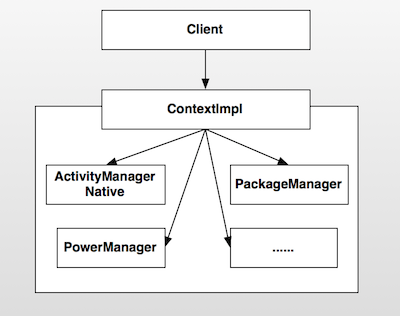

Android設計模式源碼解析之外觀模式(Facade)
====================================
> 本文為 [Android 設計模式源碼解析](https://github.com/simple-android-framework-exchange/android_design_patterns_analysis) 中 外觀模式 分析  
> Android系統版本： 2.3         
> 分析者：[elsdnwn](https://github.com/elsdnwn)、[Mr.Simple](https://github.com/bboyfeiyu)，分析狀態：已完成，校對者：[Mr.Simple](https://github.com/bboyfeiyu)，校對狀態：未開始   


## 1. 模式介紹  
 
###  模式的定義
外觀模式(也成為門面模式)要求一個子系統的外部與其內部的通信必須通過一個統一的對象進行。它提供一個高層次的接口，使得子系統更易於使用。

### 模式的使用場景
1. 在設計初期階段，將不同的兩個層分離；
2. 在開發階段，子系統往往因為不斷的重構演化而變得越來越複雜，大多數的模式使用時也都會產生很多很小的類，這本是好事，但也給外部調用它們的用戶程序帶來了使用上的困難，增加外觀Facade可以提供一個簡單的接口，減少它們之間的依賴。
3. 在維護一個遺留的大型系統時，可能這個系統已經非常難以維護和擴展了，但因為它包含非常重要的功能，新的需求開發必須依賴於它。

## 2. UML類圖
 

### 角色介紹
* Client : 客戶端程序。
* Facade : 對外的統一入口,即外觀對象。
* SubSystemA : 子系統A。
* SubSystemB : 子系統B。
* SubSystemC : 子系統C。
* SubSystemD : 子系統D。

## 不使用外觀模式
      
如上述所說，門面模式提供一個高層次的接口，使得子系統更易於使用。因此在不使用該模式的情況下，客戶端程序使用相關功能的成本就會比較的複雜，需要和各個子系統進行交互 ( 如上圖 )，這樣就使得系統的穩定性受到影響，用戶的使用成本也相對較高。      


## 3. 模式的簡單實現
###  簡單實現的介紹
電視遙控器是現實生活中一個比較好的外觀模式的運用，遙控器可以控制電源的開源、聲音的調整、頻道的切換等。這個遙控器就是我們這裡說的外觀或者門面，而電源、聲音、頻道切換系統就是我們的子系統。遙控器統一對這些子模塊的控制，我想你沒有用過多個遙控器來分別控制電源開關、聲音控制等功能。下面我們就來簡單模擬一下這個系統。     

### 實現源碼
TvController.java   

```java
public class TvController {
    private PowerSystem mPowerSystem = new PowerSystem();
    private VoiceSystem mVoiceSystem = new VoiceSystem();
    private ChannelSystem mChannelSystem = new ChannelSystem();

    public void powerOn() {
        mPowerSystem.powerOn();
    }

    public void powerOff() {
        mPowerSystem.powerOff();
    }

    public void turnUp() {
        mVoiceSystem.turnUp();
    }

    public void turnDown() {
        mVoiceSystem.turnDown();
    }

    public void nextChannel() {
        mChannelSystem.next();
    }

    public void prevChannel() {
        mChannelSystem.prev();
    }
}
```
PowerSystem.java

```java
/**
 * 電源控制系統
 */
 class PowerSystem {
    public void powerOn() {
        System.out.println("開機");
    }

    public void powerOff() {
        System.out.println("關機");
    }
}
```

VoiceSystem.java

```java
/**
 * 聲音控制系統
 */
class VoiceSystem {
    public void turnUp() {
        System.out.println("音量增大");
    }

    public void turnDown() {
        System.out.println("音量減小");
    }
}
```


ChannelSystem.java

```java
/**
 * 頻道控制系統
 */
class ChannelSystem {
    public void next() {
        System.out.println("下一頻道");
    }

    public void prev() {
        System.out.println("上一頻道");
    }
}
```

測試代碼 :     

```java
public class TvController {
    private PowerSystem mPowerSystem = new PowerSystem();
    private VoiceSystem mVoiceSystem = new VoiceSystem();
    private ChannelSystem mChannelSystem = new ChannelSystem();

    public void powerOn() {
        mPowerSystem.powerOn();
    }

    public void powerOff() {
        mPowerSystem.powerOff();
    }

    public void turnUp() {
        mVoiceSystem.turnUp();
    }

    public void turnDown() {
        mVoiceSystem.turnDown();
    }

    public void nextChannel() {
        mChannelSystem.next();
    }

    public void prevChannel() {
        mChannelSystem.prev();
    }
}

``` 

輸出結果：   

```
開機
下一頻道
音量增大
關機
``` 
上面的TvController封裝了對電源、聲音、頻道切換的操作，為用戶提供了一個統一的接口。使得用戶控制電視機更加的方便、更易於使用。        

## Android源碼中的模式實現
在開發過程中，Context是最重要的一個類型。它封裝了很多重要的操作，比如startActivity()、sendBroadcast()等，幾乎是開發者對應用操作的統一入口。Context是一個抽象類，它只是定義了抽象接口，真正的實現在ContextImpl類中。它就是今天我們要分析的外觀類。      

在應用啟動時，首先會fork一個子進程，並且調用ActivityThread.main方法啟動該進程。ActivityThread又會構建Application對象，然後和Activity、ContextImpl關聯起來，然後再調用Activity的onCreate、onStart、onResume函數使Activity運行起來。我們看看下面的相關代碼:       

```
private final void handleLaunchActivity(ActivityClientRecord r, Intent customIntent) {
		// 代碼省略

        // 1、創建並且加載Activity，調用其onCreate函數
        Activity a = performLaunchActivity(r, customIntent);

        if (a != null) {
            r.createdConfig = new Configuration(mConfiguration);
            Bundle oldState = r.state;
            // 2、調用Activity的onResume方法，使Activity變得可見
            handleResumeActivity(r.token, false, r.isForward);

        }
    }


     private final Activity performLaunchActivity(ActivityClientRecord r, Intent customIntent) {
        // System.out.println("##### [" + System.currentTimeMillis() + "] ActivityThread.performLaunchActivity(" + r + ")");
		// 代碼省略

        Activity activity = null;
        try {
            java.lang.ClassLoader cl = r.packageInfo.getClassLoader();
            // 1、創建Activity
            activity = mInstrumentation.newActivity(
                    cl, component.getClassName(), r.intent);
            r.intent.setExtrasClassLoader(cl);
            if (r.state != null) {
                r.state.setClassLoader(cl);
            }
        } catch (Exception e) {
            if (!mInstrumentation.onException(activity, e)) {
                throw new RuntimeException(
                    "Unable to instantiate activity " + component
                    + ": " + e.toString(), e);
            }
        }

        try {
            // 2、創建Application
            Application app = r.packageInfo.makeApplication(false, mInstrumentation);

            if (activity != null) {
                // ***** 構建ContextImpl  ****** 
                ContextImpl appContext = new ContextImpl();
                appContext.init(r.packageInfo, r.token, this);
                appContext.setOuterContext(activity);
                // 獲取Activity的title
                CharSequence title = r.activityInfo.loadLabel(appContext.getPackageManager());
                Configuration config = new Configuration(mConfiguration);
            
                 // 3、Activity與context, Application關聯起來
                activity.attach(appContext, this, getInstrumentation(), r.token,
                        r.ident, app, r.intent, r.activityInfo, title, r.parent,
                        r.embeddedID, r.lastNonConfigurationInstance,
                        r.lastNonConfigurationChildInstances, config);
				// 代碼省略

                // 4、回調Activity的onCreate方法
                mInstrumentation.callActivityOnCreate(activity, r.state);
           
                // 代碼省略
            }
            r.paused = true;

            mActivities.put(r.token, r);

        } catch (SuperNotCalledException e) {
            throw e;

        } catch (Exception e) {
      
        }

        return activity;
    }


    final void handleResumeActivity(IBinder token, boolean clearHide, boolean isForward) {
   
        unscheduleGcIdler();

        // 1、最終調用Activity的onResume方法
        ActivityClientRecord r = performResumeActivity(token, clearHide);
        // 代碼省略
        // 2、這裡是重點，在這裡使DecorView變得可見
        if (r.window == null && !a.mFinished && willBeVisible) {
                // 獲取Window，即PhoneWindow類型
                r.window = r.activity.getWindow();
                // 3、獲取Window的頂級視圖，並且使它可見
                View decor = r.window.getDecorView();
                decor.setVisibility(View.INVISIBLE);
                // 4、獲取WindowManager
                ViewManager wm = a.getWindowManager();
                // 5、構建LayoutParams參數
                WindowManager.LayoutParams l = r.window.getAttributes();
                a.mDecor = decor;
                l.type = WindowManager.LayoutParams.TYPE_BASE_APPLICATION;
                l.softInputMode |= forwardBit;
                if (a.mVisibleFromClient) {
                    a.mWindowAdded = true;
                    // 6、將DecorView添加到WindowManager中，最終的操作是通過WindowManagerService的addView來操作
                    wm.addView(decor, l);
                }
            } else if (!willBeVisible) {
                if (localLOGV) Slog.v(
                    TAG, "Launch " + r + " mStartedActivity set");
                r.hideForNow = true;
            }
            // 代碼省略
    }

 public final ActivityClientRecord performResumeActivity(IBinder token,
            boolean clearHide) {
        ActivityClientRecord r = mActivities.get(token);
       
        if (r != null && !r.activity.mFinished) {
                try {
                // 代碼省略
                // 執行onResume
                r.activity.performResume();
				// 代碼省略
            } catch (Exception e) {
   
            }
        }
        return r;
    }
```    

Activity啟動之後，Android給我們提供了操作系統服務的統一入口，也就是Activity本身。這些工作並不是Activity自己實現的，而是將操作委託給Activity父類ContextThemeWrapper的mBase對象，這個對象的實現類就是ContextImpl ( 也就是performLaunchActivity方法中構建的ContextImpl )。


```java
class ContextImpl extends Context {
    private final static String TAG = "ApplicationContext";
    private final static boolean DEBUG = false;
    private final static boolean DEBUG_ICONS = false;

    private static final Object sSync = new Object();
    private static AlarmManager sAlarmManager;
    private static PowerManager sPowerManager;
    private static ConnectivityManager sConnectivityManager;
    private AudioManager mAudioManager;
    LoadedApk mPackageInfo;
    private Resources mResources;
    private PackageManager mPackageManager;
    private NotificationManager mNotificationManager = null;
    private ActivityManager mActivityManager = null;
    
	// 代碼省略
    
        @Override
    public void sendBroadcast(Intent intent) {
        String resolvedType = intent.resolveTypeIfNeeded(getContentResolver());
        try {
            ActivityManagerNative.getDefault().broadcastIntent(
                mMainThread.getApplicationThread(), intent, resolvedType, null,
                Activity.RESULT_OK, null, null, null, false, false);
        } catch (RemoteException e) {
        }
    }
    
    
        @Override
    public void startActivity(Intent intent) {
        if ((intent.getFlags()&Intent.FLAG_ACTIVITY_NEW_TASK) == 0) {
            throw new AndroidRuntimeException(
                    "Calling startActivity() from outside of an Activity "
                    + " context requires the FLAG_ACTIVITY_NEW_TASK flag."
                    + " Is this really what you want?");
        }
        mMainThread.getInstrumentation().execStartActivity(
            getOuterContext(), mMainThread.getApplicationThread(), null, null, intent, -1);
    }
    
    
        @Override
    public ComponentName startService(Intent service) {
        try {
            ComponentName cn = ActivityManagerNative.getDefault().startService(
                mMainThread.getApplicationThread(), service,
                service.resolveTypeIfNeeded(getContentResolver()));
            if (cn != null && cn.getPackageName().equals("!")) {
                throw new SecurityException(
                        "Not allowed to start service " + service
                        + " without permission " + cn.getClassName());
            }
            return cn;
        } catch (RemoteException e) {
            return null;
        }
    }
    
        @Override
    public String getPackageName() {
        if (mPackageInfo != null) {
            return mPackageInfo.getPackageName();
        }
        throw new RuntimeException("Not supported in system context");
    }
}
```
可以看到，ContextImpl內部有很多xxxManager類的對象，也就是我們上文所說的各種子系統的角色。ContextImpl內部封裝了一些系統級別的操作，有的子系統功能雖然沒有實現，但是也提供了訪問該子系統的接口，比如獲取ActivityManager的getActivityManager方法。      

比如我們要啟動一個Activity的時候，我們調用的是startActivity方法，這個功能的內部實現實際上是Instrumentation完成的。ContextImpl封裝了這個功能，使得用戶根本不需要知曉Instrumentation相關的信息，直接使用startActivity即可完成相應的工作。其他的子系統功能也是類似的實現，比如啟動Service和發送廣播內部使用的是ActivityManagerNative等。ContextImpl的結構圖如下 :            


外觀模式非常的簡單，只是封裝了子系統的操作，並且暴露接口讓用戶使用，避免了用戶需要與多個子系統進行交互，降低了系統的耦合度、複雜度。如果沒有外觀模式的封裝，那麼用戶就必須知道各個子系統的相關細節，子系統之間的交互必然造成糾纏不清的關係，影響系統的穩定性、複雜度。              


## 4. 雜談
### 優點與缺點
#### 優點  
* 使用方便，使用外觀模式客戶端完全不需要知道子系統的實現過程；
* 降低客戶端與子系統的耦合；
* 更好的劃分訪問層次；

#### 缺點 
* 減少了可變性和靈活性；
* 在不引入抽象外觀類的情況下，增加新的子系統可能需要修改外觀類或客戶端的源代碼，違背了“開閉原則”；


