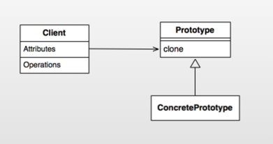
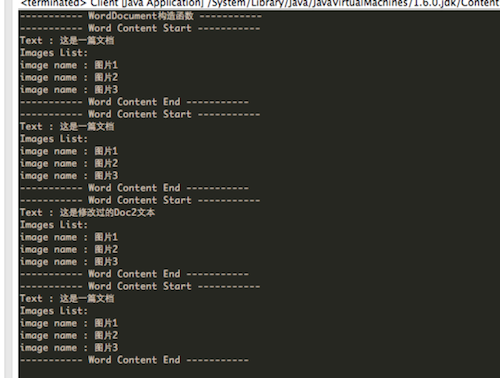
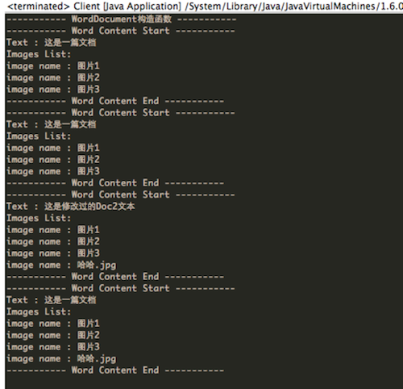
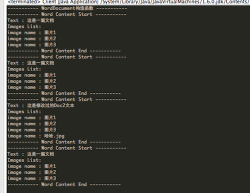
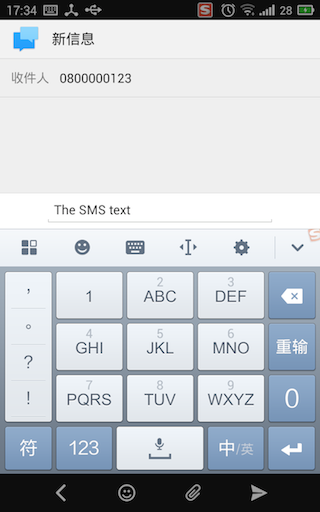

Android設計模式源碼解析之原型模式 
====================================
> 本文為 [Android 設計模式源碼解析](https://github.com/simple-android-framework-exchange/android_design_patterns_analysis) 中 原型模式 分析  
> Android系統版本： 2.3         
> 分析者：[Mr.Simple](https://github.com/bboyfeiyu)，分析狀態：未完成，校對者：[Mr.Simple](https://github.com/bboyfeiyu)，校對狀態：完成    

## 1. 模式介紹  
 
###  模式的定義
用原型實例指定創建對象的種類，並通過拷貝這些原型創建新的對象。


### 模式的使用場景
1. 類初始化需要消化非常多的資源，這個資源包括數據、硬件資源等，通過原型拷貝避免這些消耗；
2. 通過 new 產生一個對象需要非常繁瑣的數據準備或訪問權限，則可以使用原型模式；
3. 一個對象需要提供給其他對象訪問，而且各個調用者可能都需要修改其值時，可以考慮使用原型模式拷貝多個對象供調用者使用，即保護性拷貝。 
 

## 2. UML類圖


### 角色介紹
* Client  :  客戶端用戶。
* Prototype : 抽象類或者接口，聲明具備clone能力。
* ConcretePrototype : 具體的原型類.


## 3. 模式的簡單實現
###  簡單實現的介紹   

下面我們以簡單的文檔拷貝為例來演示一下簡單的原型模式模式。     

### 實現源碼

```java
package com.dp.example.builder;


package com.dp.example.prototype;

import java.util.ArrayList;
import java.util.List;

/**
 * 文檔類型, 扮演的是ConcretePrototype角色，而cloneable是代表prototype角色
 * 
 * @author mrsimple
 */
public class WordDocument implements Cloneable {
    /**
     * 文本
     */
    private String mText;
    /**
     * 圖片名列表
     */
    private ArrayList<String><string> mImages = new ArrayList<String><string>();

    public WordDocument() {
        System.out.println("----------- WordDocument構造函數 -----------");
    }

    /**
     * 克隆對象
     */
    @Override
    protected WordDocument clone() {
        try {
            WordDocument doc = (WordDocument) super.clone();
            doc.mText = this.mText;
            doc.mImages = this.mImages;
            return doc;
        } catch (Exception e) {
        }

        return null;
    }

    public String getText() {
        return mText;
    }

    public void setText(String mText) {
        this.mText = mText;
    }

    public List<string> getImages() {
        return mImages;
    }

    /**
     * @param img
     */
    public void addImage(String img) {
        this.mImages.add(img);
    }

    /**
     * 打印文檔內容
     */
    public void showDocument() {
        System.out.println("----------- Word Content Start -----------");
        System.out.println("Text : " + mText);
        System.out.println("Images List: ");
        for (String imgName : mImages) {
            System.out.println("image name : " + imgName);
        }
        System.out.println("----------- Word Content End -----------");
    }
}
```

通過WordDocument類模擬了word文檔中的基本元素，即文字和圖片。WordDocument的在該原型模式示例中扮演的角色為ConcretePrototype， 而Cloneable的角色則為Prototype。WordDocument實現了clone方法以實現對象克隆。下面我們看看Client端的使用 :       

```java
public class Client {
    public static void main(String[] args) {
        WordDocument originDoc = new WordDocument();
        originDoc.setText("這是一篇文檔");
        originDoc.addImage("圖片1");
        originDoc.addImage("圖片2");
        originDoc.addImage("圖片3");
        originDoc.showDocument();

        WordDocument doc2 = originDoc.clone();
        doc2.showDocument();
        
        doc2.setText("這是修改過的Doc2文本");
        doc2.showDocument();
         
        originDoc.showDocument();
    }

}
```
輸出結果如下 :     


可以看到，doc2是通過originDoc.clone()創建的，並且doc2第一次輸出的時候和originDoc輸出是一樣的。即doc2是originDoc的一份拷貝，他們的內容是一樣的，而doc2修改了文本內容以後並不會影響originDoc的文本內容。需要注意的是通過clone拷貝對象的時候並不會執行構造函數！


### 淺拷貝和深拷貝
將main函數的內容修改為如下 :    

```java
    public static void main(String[] args) {
        WordDocument originDoc = new WordDocument();
        originDoc.setText("這是一篇文檔");
        originDoc.addImage("圖片1");
        originDoc.addImage("圖片2");
        originDoc.addImage("圖片3");
        originDoc.showDocument();

        WordDocument doc2 = originDoc.clone();
        
        doc2.showDocument();
        
        doc2.setText("這是修改過的Doc2文本");
        doc2.addImage("哈哈.jpg");
        doc2.showDocument();
        
        originDoc.showDocument();
    }
```

輸出結果如下 :  
       
細心的朋友可能發現了，在doc2添加了一張名為"哈哈.jpg"的照片，但是卻也顯示在originDoc中？這是怎麼回事呢？  其實學習過C++的朋友都知道，這是因為上文中WordDocument的clone方法中只是簡單的進行淺拷貝，引用類型的新對象doc2的mImages只是單純的指向了this.mImages引用，而並沒有進行拷貝。doc2的mImages添加了新的圖片，實際上也就是往originDoc裡添加了新的圖片，所以originDoc裡面也有"哈哈.jpg" 。那如何解決這個問題呢？  那就是採用深拷貝，即在拷貝對象時，對於引用型的字段也要採用拷貝的形式，而不是單純引用的形式。示例如下 :       

```java
    /**
     * 克隆對象
     */
    @Override
    protected WordDocument clone() {
        try {
            WordDocument doc = (WordDocument) super.clone();
            doc.mText = this.mText;
//            doc.mImages = this.mImages;
            doc.mImages = (ArrayList<String>) this.mImages.clone();
            return doc;
        } catch (Exception e) {
        }

        return null;
    }
```

如上代碼所示，將doc.mImages指向this.mImages的一份拷貝， 而不是this.mImages本身，這樣在doc2添加圖片時並不會影響originDoc，如圖所示 :      
        
 	

## Android源碼中的模式實現
在Android源碼中，我們以熟悉的Intent來分析源碼中的原型模式。簡單示例如下 :      

```java
    Uri uri = Uri.parse("smsto:0800000123");    
    Intent shareIntent = new Intent(Intent.ACTION_SENDTO, uri);    
    shareIntent.putExtra("sms_body", "The SMS text");    
    
    Intent intent = (Intent)shareIntent.clone() ;
    startActivity(intent);
```

結果如下 :

        

可以看到，我們通過shareIntent.clone方法拷貝了一個對象intent, 然後執行startActivity(intent)， 隨即就進入了短信頁面，號碼為0800000123,文本內容為The SMS text，即這些內容都與shareIntent一致。   

```java
    @Override
    public Object clone() {
        return new Intent(this);
    }

    /**
     * Copy constructor.
     */
    public Intent(Intent o) {
        this.mAction = o.mAction;
        this.mData = o.mData;
        this.mType = o.mType;
        this.mPackage = o.mPackage;
        this.mComponent = o.mComponent;
        this.mFlags = o.mFlags;
        if (o.mCategories != null) {
            this.mCategories = new ArraySet<String>(o.mCategories);
        }
        if (o.mExtras != null) {
            this.mExtras = new Bundle(o.mExtras);
        }
        if (o.mSourceBounds != null) {
            this.mSourceBounds = new Rect(o.mSourceBounds);
        }
        if (o.mSelector != null) {
            this.mSelector = new Intent(o.mSelector);
        }
        if (o.mClipData != null) {
            this.mClipData = new ClipData(o.mClipData);
        }
    }
```

 可以看到，clone方法實際上在內部調用了new Intent(this); 這就和C++中的拷貝構造函數完全一致了，而且是深拷貝。由於該模式比較簡單，就不做太多說明。   
 

## 4. 雜談
### 優點與缺點
* 優點    
原型模式是在內存二進制流的拷貝，要比直接 new 一個對象性能好很多，特別是要在一個循環體內產生大量的對象時，原型模式可以更好地體現其優點。

* 缺點   
這既是它的優點也是缺點，直接在內存中拷貝，構造函數是不會執行的，在實際開發當中應該注意這個潛在的問題。優點就是減少了約束，缺點也是減少了約束，需要大家在實際應用時考慮。

