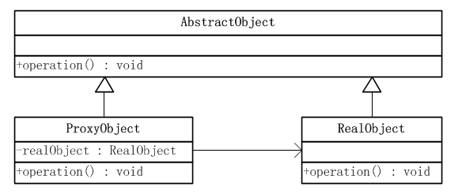

Android設計模式源碼解析之Proxy模式 
====================================
> 本文為 [Android 設計模式源碼解析](https://github.com/simple-android-framework-exchange/android_design_patterns_analysis) 中 Proxy模式 分析  
> Android系統版本： 5.0       
> 分析者：[singwhatiwanna](https://github.com/singwhatiwanna)，分析狀態：完成，校對者：[Mr.Simple](https://github.com/bboyfeiyu)，校對狀態：未校對     

#Binder中的代理模式

再說Binder中的代理模式之前，我們需要先看看代理模式的簡單實現，這一部分內容採用了[《JAVA與模式》之代理模式](http://www.cnblogs.com/java-my-life/archive/2012/04/23/2466712.html)這篇文章中的代碼示例和uml類圖。

## 1. 模式介紹  
代理模式是對象的結構模式。代理模式給某一個對象提供一個代理對象，並由代理對象控制對原對象的引用。

### 模式的使用場景
就是一個人或者機構代表另一個人或者機構採取行動。在一些情況下，一個客戶不想或者不能夠直接引用一個對象，而代理對象可以在客戶端和目標對象之間起到中介的作用。

## 2. UML類圖


### 角色介紹
* 抽象對象角色：聲明瞭目標對象和代理對象的共同接口，這樣一來在任何可以使用目標對象的地方都可以使用代理對象。

* 目標對象角色：定義了代理對象所代表的目標對象。

* 代理對象角色：代理對象內部含有目標對象的引用，從而可以在任何時候操作目標對象；代理對象提供一個與目標對象相同的接口，以便可以在任何時候替代目標對象。代理對象通常在客戶端調用傳遞給目標對象之前或之後，執行某個操作，而不是單純地將調用傳遞給目標對象。

## 3. 模式的簡單實現
###  簡單實現的介紹
下面通過一種抽象的方式來實現下代理模式

### 實現源碼
抽象對象角色

```
public abstract class AbstractObject {
    //操作
    public abstract void operation();
}
```

目標對象角色
```
public class RealObject extends AbstractObject {
    @Override
    public void operation() {
        //一些操作
        System.out.println("一些操作");
    }
}
```

代理對象角色
```
public class ProxyObject extends AbstractObject{
    RealObject realObject = new RealObject();
    @Override
    public void operation() {
        //調用目標對象之前可以做相關操作
        System.out.println("before");        
        realObject.operation();        
        //調用目標對象之後可以做相關操作
        System.out.println("after");
    }
}
```

客戶端
```
public class Client {
    public static void main(String[] args) {
        AbstractObject obj = new ProxyObject();
        obj.operation();
    }
}
```
## 4. 代理模式在Binder中的使用
直觀來說，Binder是Android中的一個類，它繼承了IBinder接口。從IPC角度來說，Binder是Android中的一種跨進程通信方式，Binder還可以理解為一種虛擬的物理設備，它的設備驅動是/dev/binder，該通信方式在linux中沒有；從Android Framework角度來說，Binder是ServiceManager連接各種Manager（ActivityManager、WindowManager，etc）和相應ManagerService的橋樑；從Android應用層來說，Binder是客戶端和服務端進行通信的媒介，當你bindService的時候，服務端會返回一個包含了服務端業務調用的Binder對象，通過這個Binder對象，客戶端就可以獲取服務端提供的服務或者數據，這裡的服務包括普通服務和基於AIDL的服務。

Binder一個很重要的作用是：將客戶端的請求參數通過Parcel包裝後傳到遠程服務端，遠程服務端解析數據並執行對應的操作，同時客戶端線程掛起，當服務端方法執行完畢後，再將返回結果寫入到另外一個Parcel中並將其通過Binder傳回到客戶端，客戶端接收到返回數據的Parcel後，Binder會解析數據包中的內容並將原始結果返回給客戶端，至此，整個Binder的工作過程就完成了。由此可見，Binder更像一個數據通道，Parcel對象就在這個通道中跨進程傳輸，至於雙方如何通信，這並不負責，只需要雙方按照約定好的規範去打包和解包數據即可。

為了更好地說明Binder，這裡我們先手動實現了一個Binder。為了使得邏輯更清晰，這裡簡化一下，我們來模擬一個銀行系統，這個銀行提供的功能只有一個：即查詢餘額，只有傳遞一個int的id過來，銀行就會將你的餘額設置為id*10，滿足下大家的發財夢。

1. 先定義一個Binder接口
 ```
package com.ryg.design.manualbinder;

import android.os.IBinder;
import android.os.IInterface;
import android.os.RemoteException;

public interface IBank extends IInterface {

    static final String DESCRIPTOR = "com.ryg.design.manualbinder.IBank";

    static final int TRANSACTION_queryMoney = (IBinder.FIRST_CALL_TRANSACTION + 0);

    public long queryMoney(int uid) throws RemoteException;

}
```

2.創建一個Binder並實現這個上述接口
```
package com.ryg.design.manualbinder;

import android.os.Binder;
import android.os.IBinder;
import android.os.Parcel;
import android.os.RemoteException;

public class BankImpl extends Binder implements IBank {

    public BankImpl() {
        this.attachInterface(this, DESCRIPTOR);
    }

    public static IBank asInterface(IBinder obj) {
        if ((obj == null)) {
            return null;
        }
        android.os.IInterface iin = obj.queryLocalInterface(DESCRIPTOR);
        if (((iin != null) && (iin instanceof IBank))) {
            return ((IBank) iin);
        }
        return new BankImpl.Proxy(obj);
    }

    @Override
    public IBinder asBinder() {
        return this;
    }

    @Override
    public boolean onTransact(int code, Parcel data, Parcel reply, int flags)
            throws RemoteException {
        switch (code) {
        case INTERFACE_TRANSACTION: {
            reply.writeString(DESCRIPTOR);
            return true;
        }
        case TRANSACTION_queryMoney: {
            data.enforceInterface(DESCRIPTOR);
            int uid = data.readInt();
            long result = this.queryMoney(uid);
            reply.writeNoException();
            reply.writeLong(result);
            return true;
        }
        }
        return super.onTransact(code, data, reply, flags);
    }

    @Override
    public long queryMoney(int uid) throws RemoteException {
        return uid * 10l;
    }

    private static class Proxy implements IBank {
        private IBinder mRemote;

        Proxy(IBinder remote) {
            mRemote = remote;
        }

        @Override
        public IBinder asBinder() {
            return mRemote;
        }

        public java.lang.String getInterfaceDescriptor() {
            return DESCRIPTOR;
        }

        @Override
        public long queryMoney(int uid) throws RemoteException {
            Parcel data = Parcel.obtain();
            Parcel reply = Parcel.obtain();
            long result;
            try {
                data.writeInterfaceToken(DESCRIPTOR);
                data.writeInt(uid);
                mRemote.transact(TRANSACTION_queryMoney, data, reply, 0);
                reply.readException();
                result = reply.readLong();
            } finally {
                reply.recycle();
                data.recycle();
            }
            return result;
        }

    }

}
```
ok，到此為止，我們的Binder就完成了，這裡只要創建服務端和客戶端，二者就能通過我們的Binder來通信了。這裡就不做這個示例了，我們的目的是分析代理模式在Binder中的使用。

我們看上述Binder的實現中，有一個叫做“Proxy”的類，它的構造方法如下：
```
  Proxy(IBinder remote) {
      mRemote = remote;
  }
```
Proxy類接收一個IBinder參數，這個參數實際上就是服務端Service中的onBind方法返回的Binder對象在客戶端重新打包後的結果，因為客戶端無法直接通過這個打包的Binder和服務端通信，因此客戶端必須藉助Proxy類來和服務端通信，這裡Proxy的作用就是代理的作用，客戶端所有的請求全部通過Proxy來代理，具體工作流程為：Proxy接收到客戶端的請求後，會將客戶端的請求參數打包到Parcel對象中，然後將Parcel對象通過它內部持有的Ibinder對象傳送到服務端，服務端接收數據、執行方法後返回結果給客戶端的Proxy，Proxy解析數據後返回給客戶端的真正調用者。很顯然，上述所分析的就是典型的代理模式。至於Binder如何傳輸數據，這涉及到很底層的知識，這個很難搞懂，但是數據傳輸的核心思想是共享內存。

## 5. 雜談
### 優點與缺點
#### 優點  
* 給對象增加了本地化的擴展性，增加了存取操作控制

#### 缺點 
* 會產生多餘的代理類
