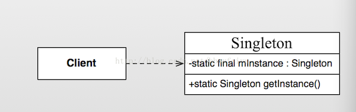
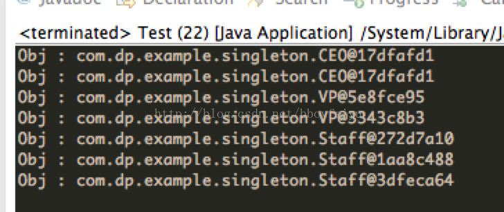

Android設計模式源碼解析之單例模式 
====================================
> 本文為 [Android 設計模式源碼解析](https://github.com/simple-android-framework-exchange/android_design_patterns_analysis) 中 單例模式 分析  
> Android系統版本： 2.3        
> 分析者：[Mr.Simple](https://github.com/bboyfeiyu)，分析狀態：完成，校對者：[Mr.Simple](https://github.com/bboyfeiyu)，校對狀態：完成   
 

## 1. 模式介紹  
 
###  模式的定義
確保某一個類只有一個實例，而且自行實例化並向整個系統提供這個實例。


### 模式的使用場景
確保某個類有且只有一個對象的場景，例如創建一個對象需要消耗的資源過多，如要訪問 IO 和數據庫等資源。
 

## 2. UML類圖
  

### 角色介紹
* Client : 高層客戶端。
* Singleton : 單例類。


## 3. 模式的簡單實現
###  簡單實現的介紹
單例模式是設計模式中最簡單的，只有一個單例類，沒有其他的層次結構與抽象。該模式需要確保該類只能生成一個對象，通常是該類需要消耗太多的資源或者沒有沒有多個實例的理由。例如一個公司只有一個CEO、一臺電腦通常只有一個顯示器等。下面我們以公司裡的CEO為例來簡單演示一下，一個公司可以有幾個VP，無數個員工，但是CEO只有一個，請看下面示例。 

### 實現源碼

```java
package com.dp.example.singleton;
/**
 * 人的基類
 * @author mrsimple
 *
 */
public abstract class Person {
	public abstract void talk() ;
}

// 普通員工
public class Staff extends Person {

	@Override
	public void talk() {

	}

}

// 副總裁
public class VP extends Person {

	@Override
	public void talk() {

	}
}

// CEO， 單例模式
public class CEO extends Person {

	private static final CEO mCeo = new CEO();

	private CEO() {
	}

	public static CEO getCeo() {
		return mCeo;
	}

	@Override
	public void talk() {
		System.out.println("CEO發表講話");
	}

}

// 公司類
import java.util.ArrayList;
import java.util.List;

public class Company {
	private List<Person> allPersons = new ArrayList<Person>();

	public void addStaff(Person per) {
		allPersons.add(per);
	}

	public void showAllStaffs() {
		for (Person per : allPersons) {
			System.out.println("Obj : " + per.toString());
		}
	}
}

// test
public class Test {
	public static void main(String[] args) {
		Company cp = new Company() ;
		Person ceo1 = CEO.getCeo() ;
		Person ceo2 = CEO.getCeo() ;
		cp.addStaff(ceo1);
		cp.addStaff(ceo2);
		
		Person vp1 = new VP() ;
		Person vp2 = new VP() ;
		
		Person staff1 = new Staff() ;
		Person staff2 = new Staff() ;
		Person staff3 = new Staff() ;
		
		cp.addStaff(vp1);
		cp.addStaff(vp2);
		cp.addStaff(staff1);
		cp.addStaff(staff2);
		cp.addStaff(staff3);
		
		cp.showAllStaffs();
	}
}
```    

輸出結果如下 : 
    

可以看到, CEO兩次輸出的CEO對象的文字描述都是一樣的，而VP、Staff類的對象都是不同的。即CEO是唯一實例，而其他類型都是不同的實例。這個實現的核心在於將CEO類的構造方法私有化，使得外部程序不能通過構造函數來構造CEO對象，而CEO類通過一個靜態方法返回一個唯一的對象。


### 單例模式的其他實現

```java
package com.dp.example.singleton;

public class Singleton {
	private static Singleton mInstance = null;

	private Singleton() {

	}

	public void doSomething() {
		System.out.println("do sth.");
	}

	/**
	 * 方式二、double-check， 避免併發時創建了多個實例, 該方式不能完全避免併發帶來的破壞.
	 * 
	 * @return
	 */
	public static Singleton getInstance() {
		if (mInstance == null) {
			synchronized (Singleton.class) {
				if (mInstance == null) {
					mInstance = new Singleton();
				}
			}
		}
		return mInstance;
	}

	/**
	 * 方式三 : 在第一次加載SingletonHolder時初始化一次mOnlyInstance對象, 保證唯一性, 也延遲了單例的實例化,
	 * 如果該單例比較耗資源可以使用這種模式.
	 * 
	 * @return
	 */
	public static Singleton getInstanceFromHolder() {
		return SingletonHolder.mOnlyInstance;
	}

	/**
	 * 靜態內部類
	 * 
	 * @author mrsimple
	 *
	 */
	private static class SingletonHolder {
		private static final Singleton mOnlyInstance = new Singleton();
	}

	/**
	 *  方式四 : 枚舉單例, 線程安全
	 * @author mrsimple
	 *
	 */
	enum SingletonEnum {
		INSTANCE;
		public void doSomething() {
			System.out.println("do sth.");
		}
	}

	/**
	 * 方式五 : 註冊到容器, 根據key獲取對象.一般都會有多種相同屬性類型的對象會註冊到一個map中
	 * instance容器
	 */
	private static Map<string singleton=""> objMap = new HashMap<string singleton="">();
	/**
	 * 註冊對象到map中
	 * @param key
	 * @param instance
	 */
	public static void registerService(String key, Singleton instance) {
		if (!objMap.containsKey(key) ) {
			objMap.put(key, instance) ;
		}
	}
	
	/**
	 * 根據key獲取對象
	 * @param key
	 * @return
	 */
	public static Singleton getService(String key) {
		return objMap.get(key) ;
	}

}
```    
不管以哪種形式實現單例模式，它們的核心原理都是將構造函數私有化，並且通過靜態方法獲取一個唯一的實例，在這個獲取的過程中你必須保證線程安全、反序列化導致重新生成實例對象等問題，該模式簡單，但使用率較高。       

## Android源碼中的模式實現
在Android系統中，我們經常會通過Context獲取系統級別的服務，比如WindowsManagerService, ActivityManagerService等，更常用的是一個叫LayoutInflater的類。這些服務會在合適的時候以單例的形式註冊在系統中，在我們需要的時候就通過Context的getSystemService(String name)獲取。我們以LayoutInflater為例來說明, 平時我們使用LayoutInflater較為常見的地方是在ListView的getView方法中。 

```java
@Override
public View getView(int position, View convertView, ViewGroup parent)	
	View itemView = null;
	if (convertView == null) {
		itemView = LayoutInflater.from(mContext).inflate(mLayoutId, null);
		// 其他代碼
	} else {
		itemView = convertView;
	}
	// 獲取Holder
	// 初始化每項的數據
	return itemView;
}
```

通常我們使用LayoutInflater.from(Context)來獲取LayoutInflater服務, 下面我們看看LayoutInflater.from(Context)的實現。

```
    /**
     * Obtains the LayoutInflater from the given context.
     */
    public static LayoutInflater from(Context context) {
        LayoutInflater LayoutInflater =
                (LayoutInflater) context.getSystemService(Context.LAYOUT_INFLATER_SERVICE);
        if (LayoutInflater == null) {
            throw new AssertionError("LayoutInflater not found.");
        }
        return LayoutInflater;
    }
```  

可以看到from(Context)函數內部調用的是Context類的getSystemService(String key)方法，我們跟蹤到Context類看到, 該類是抽象類。

```java
public abstract class Context {
    // 省略
}
```     

使用的getView中使用的Context對象的具體實現類是什麼呢 ？其實在Application，Activity, Service,中都會存在一個Context對象，即Context的總個數為Activity個數 + Service個數 + 1。而ListView通常都是顯示在Activity中，那麼我們就以Activity中的Context來分析。    

我們知道，一個Activity的入口是ActivityThread的main函數。在該main函數中創建一個新的ActivityThread對象，並且啟動消息循環(UI線程)，創建新的Activity、新的Context對象，然後將該Context對象傳遞給Activity。下面我們看看ActivityThread源碼。    

```java
    public static void main(String[] args) {
        SamplingProfilerIntegration.start();

        // CloseGuard defaults to true and can be quite spammy.  We
        // disable it here, but selectively enable it later (via
        // StrictMode) on debug builds, but using DropBox, not logs.
        CloseGuard.setEnabled(false);

        Environment.initForCurrentUser();

        // Set the reporter for event logging in libcore
        EventLogger.setReporter(new EventLoggingReporter());
        Process.setArgV0("<pre-initialized>");
        // 主線程消息循環
        Looper.prepareMainLooper();
        // 創建ActivityThread對象
        ActivityThread thread = new ActivityThread();
        thread.attach(false);

        if (sMainThreadHandler == null) {
            sMainThreadHandler = thread.getHandler();
        }

        AsyncTask.init();

        if (false) {
            Looper.myLooper().setMessageLogging(new
                    LogPrinter(Log.DEBUG, "ActivityThread"));
        }

        Looper.loop();

        throw new RuntimeException("Main thread loop unexpectedly exited");
    }

    private void attach(boolean system) {
        sThreadLocal.set(this);
        mSystemThread = system;
        if (!system) {
            ViewRootImpl.addFirstDrawHandler(new Runnable() {
                public void run() {
                    ensureJitEnabled();
                }
            });
            android.ddm.DdmHandleAppName.setAppName("<pre-initialized>",
                                                    UserHandle.myUserId());
            RuntimeInit.setApplicationObject(mAppThread.asBinder());
            IActivityManager mgr = ActivityManagerNative.getDefault();
            try {
                mgr.attachApplication(mAppThread);
            } catch (RemoteException ex) {
                // Ignore
            }
        } else {
               // 省略
        }
}
```    

在main方法中，我們創建一個ActivityThread對象後，調用了其attach函數，並且參數為false. 在attach函數中， 參數為false的情況下， 會通過Binder機制與ActivityManagerService通信，並且最終調用handleLaunchActivity函數 ( 具體分析請參考老羅的博客 : [Activity的啟動流程](http://blog.csdn.net/luoshengyang/article/details/6689748))，我們看看該函數的實現 。     

```java

    private void handleLaunchActivity(ActivityClientRecord r, Intent customIntent) {
        // 代碼省略
        Activity a = performLaunchActivity(r, customIntent);
        // 代碼省略
    }
    
     private Activity performLaunchActivity(ActivityClientRecord r, Intent customIntent) {
        // System.out.println("##### [" + System.currentTimeMillis() + "] ActivityThread.performLaunchActivity(" + r + ")");
        // 代碼省略
        Activity activity = null;
        try {
            java.lang.ClassLoader cl = r.packageInfo.getClassLoader();
            activity = mInstrumentation.newActivity(         // 1 : 創建Activity
                    cl, component.getClassName(), r.intent);
         // 代碼省略
        } catch (Exception e) {
         // 省略
        }

        try {
            Application app = r.packageInfo.makeApplication(false, mInstrumentation);

            if (activity != null) {
                Context appContext = createBaseContextForActivity(r, activity); // 2 : 獲取Context對象
                CharSequence title = r.activityInfo.loadLabel(appContext.getPackageManager());
                Configuration config = new Configuration(mCompatConfiguration);
                // 3: 將appContext等對象attach到activity中
                activity.attach(appContext, this, getInstrumentation(), r.token,
                        r.ident, app, r.intent, r.activityInfo, title, r.parent,
                        r.embeddedID, r.lastNonConfigurationInstances, config);

                // 代碼省略
                // 4 ： 調用Activity的onCreate方法
                mInstrumentation.callActivityOnCreate(activity, r.state);
                // 代碼省略
        } catch (SuperNotCalledException e) {
            throw e;
        } catch (Exception e) {
            // 代碼省略
        }

        return activity;
    }


    private Context createBaseContextForActivity(ActivityClientRecord r,
            final Activity activity) {
        // 5 ： 創建Context對象, 可以看到實現類是ContextImpl
        ContextImpl appContext = new ContextImpl();           appContext.init(r.packageInfo, r.token, this);
        appContext.setOuterContext(activity);

        // 代碼省略
        return baseContext;
    }
    
```   

通過上面1~5的代碼分析可以知道， Context的實現類為ComtextImpl類。我們繼續跟蹤到ContextImpl類。 

```java
class ContextImpl extends Context {
  
    // 代碼省略
    /**
     * Override this class when the system service constructor needs a
     * ContextImpl.  Else, use StaticServiceFetcher below.
     */
     static class ServiceFetcher {
        int mContextCacheIndex = -1;

        /**
         * Main entrypoint; only override if you don't need caching.
         */
        public Object getService(ContextImpl ctx) {
            ArrayList<Object> cache = ctx.mServiceCache;
            Object service;
            synchronized (cache) {
                if (cache.size() == 0) {
                    for (int i = 0; i < sNextPerContextServiceCacheIndex; i++) {
                        cache.add(null);
                    }
                } else {
                    service = cache.get(mContextCacheIndex);
                    if (service != null) {
                        return service;
                    }
                }
                service = createService(ctx);
                cache.set(mContextCacheIndex, service);
                return service;
            }
        }

        /**
         * Override this to create a new per-Context instance of the
         * service.  getService() will handle locking and caching.
         */
        public Object createService(ContextImpl ctx) {
            throw new RuntimeException("Not implemented");
        }
    }

    // 1 : service容器
    private static final HashMap<String, ServiceFetcher> SYSTEM_SERVICE_MAP =
            new HashMap<String, ServiceFetcher>();

    private static int sNextPerContextServiceCacheIndex = 0;
    // 2: 註冊服務器
    private static void registerService(String serviceName, ServiceFetcher fetcher) {
        if (!(fetcher instanceof StaticServiceFetcher)) {
            fetcher.mContextCacheIndex = sNextPerContextServiceCacheIndex++;
        }
        SYSTEM_SERVICE_MAP.put(serviceName, fetcher);
    }


    // 3: 靜態語句塊, 第一次加載該類時執行 ( 只執行一次, 保證實例的唯一性. )
    static {
        //  代碼省略
        // 註冊Activity Servicer
        registerService(ACTIVITY_SERVICE, new ServiceFetcher() {
                public Object createService(ContextImpl ctx) {
                    return new ActivityManager(ctx.getOuterContext(), ctx.mMainThread.getHandler());
                }});

        // 註冊LayoutInflater service
        registerService(LAYOUT_INFLATER_SERVICE, new ServiceFetcher() {
                public Object createService(ContextImpl ctx) {
                    return PolicyManager.makeNewLayoutInflater(ctx.getOuterContext());
                }});
        // 代碼省略
    }

    // 4: 根據key獲取對應的服務, 
    @Override
    public Object getSystemService(String name) {
        // 根據name來獲取服務
        ServiceFetcher fetcher = SYSTEM_SERVICE_MAP.get(name);
        return fetcher == null ? null : fetcher.getService(this);
    }

    // 代碼省略
}

```     

從ContextImpl類的部分代碼中可以看到，在虛擬機第一次加載該類時會註冊各種服務，其中就包含了LayoutInflater Service, 將這些服務以鍵值對的形式存儲在一個HashMap中，用戶使用時只需要根據key來獲取到對應的服務，從而達到單例的效果。這種模式就是上文中提到的“單例模式的實現方式5”。系統核心服務以單例形式存在，減少了資源消耗。         


## 4. 雜談
### 優點與缺點
#### 優點  
* 由於單例模式在內存中只有一個實例，減少了內存開支，特別是一個對象需要頻繁地創建、銷燬時，而且創建或銷燬時性能又無法優化，單例模式的優勢就非常明顯。
* 由於單例模式只生成一個實例，所以減少了系統的性能開銷，當一個對象的產生需要比較多的資源時，如讀取配置、產生其他依賴對象時，則可以通過在應用啟動時直接產生一個單例對象，然後用永久駐留內存的方式來解決；
* 單例模式可以避免對資源的多重佔用，例如一個寫文件動作，由於只有一個實例存在內存中，避免對同一個資源文件的同時寫操作。
* 單例模式可以在系統設置全局的訪問點，優化和共享資源訪問，例如可以設計一個單例類，負責所有數據表的映射處理。

#### 缺點 
* 單例模式一般沒有接口，擴展很困難，若要擴展，除了修改代碼基本上沒有第二種途徑可以實現。 
