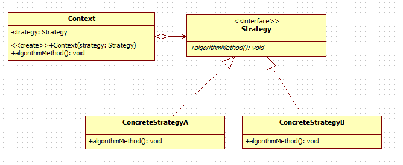
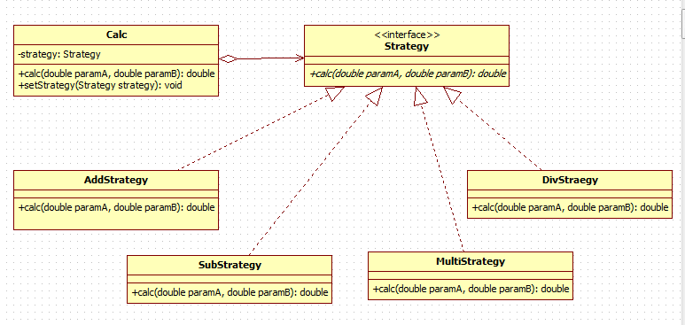
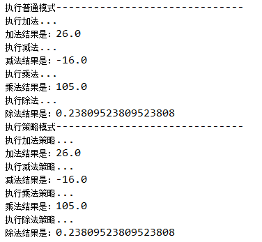
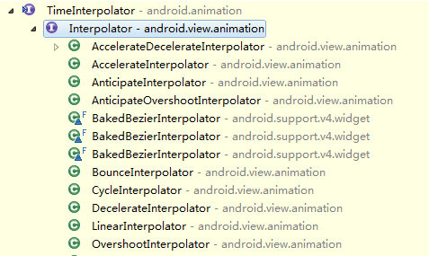
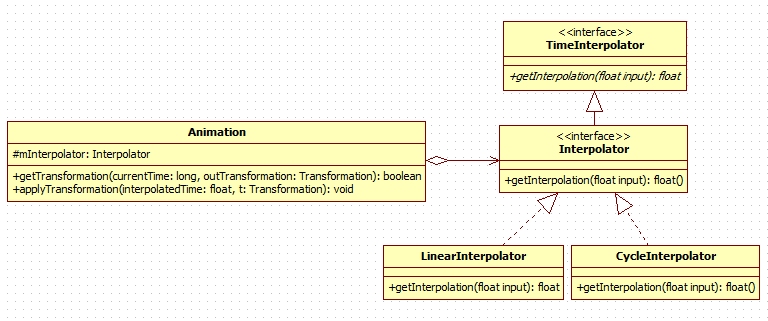

Android設計模式源碼解析之策略模式 
====================================
> 本文為 [Android 設計模式源碼解析](https://github.com/simple-android-framework/android_design_patterns_analysis) 中策略模式分析  
> Android系統版本：4.4.2         
> 分析者：[GKerison](https://github.com/GKerison)，分析狀態：已完成，校對者：[Mr.Simple](https://github.com/bboyfeiyu)，校對狀態：完成   

## 1. 模式介紹  
 
###  模式的定義
**策略模式定義了一系列的算法，並將每一個算法封裝起來，而且使它們還可以相互替換。策略模式讓算法獨立於使用它的客戶而獨立變化。**

`注：針對同一類型操作，將複雜多樣的處理方式分別開來，有選擇的實現各自特有的操作。`

### 模式的使用場景
* 針對同一類型問題的多種處理方式，僅僅是具體行為有差別時。
* 需要安全的封裝多種同一類型的操作時。
* 出現同一抽象多個子類，而又需要使用if-else 或者 switch-case來選擇時。
 

## 2. UML類圖
  

### 角色介紹
* Context：用來操作策略的上下文環境。
* Strategy : 策略的抽象。
* ConcreteStrategyA、ConcreteStrategyB : 具體的策略實現。


## 3. 模式的簡單實現
###  簡單實現的介紹
通常如果一個問題有多個解決方案或者稍有區別的操作時，最簡單的方式就是利用if-else or switch-case方式來解決，對於簡單的解決方案這樣做無疑是比較簡單、方便、快捷的，但是如果解決方案中包括大量的處理邏輯需要封裝，或者處理方式變動較大的時候則就顯得混亂、複雜，而策略模式則很好的解決了這樣的問題，它將各種方案分離開來，讓操作者根據具體的需求來動態的選擇不同的策略方案。
這裡以簡單的計算操作(+、-、*、/)作為示例：

### 未使用策略模式

```java
	public static double calc(String op, double paramA, double paramB) {
		if ("+".equals(op)) {
			System.out.println("執行加法...");
			return paramA + paramB;
		} else if ("-".equals(op)) {
			System.out.println("執行減法...");
			return paramA - paramB;
		} else if ("*".equals(op)) {
			System.out.println("執行乘法...");
			return paramA * paramB;
		} else if ("/".equals(op)) {
			System.out.println("執行除法...");
			if (paramB == 0) {
				throw new IllegalArgumentException("除數不能為0!");
			}
			return paramA / paramB;
		} else {
			throw new IllegalArgumentException("未找到計算方法!");
		}
	}
```

### 使用策略模式
UML類圖
  

* Calc：進行計算操作的上下文環境。
* Strategy : 計算操作的抽象。
* AddStrategy、SubStrategy、MultiStrategy、DivStrategy : 具體的 +、-、*、/ 實現。

具體實現代碼如下：

```java 
	//針對操作進行抽象
	public interface Strategy {
		public double calc(double paramA, double paramB);
	}
	
	//加法的具體實現策略
	public class AddStrategy implements Strategy {
		@Override
		public double calc(double paramA, double paramB) {
			// TODO Auto-generated method stub
			System.out.println("執行加法策略...");
			return paramA + paramB;
		}
	}

	//減法的具體實現策略
	public class SubStrategy implements Strategy {
		@Override
		public double calc(double paramA, double paramB) {
			// TODO Auto-generated method stub
			System.out.println("執行減法策略...");
			return paramA - paramB;
		}
	}

	//乘法的具體實現策略
	public class MultiStrategy implements Strategy {
		@Override
		public double calc(double paramA, double paramB) {
			// TODO Auto-generated method stub
			System.out.println("執行乘法策略...");
			return paramA * paramB;
		}
	}

	//除法的具體實現策略
	public class DivStrategy implements Strategy {
		@Override
		public double calc(double paramA, double paramB) {
			// TODO Auto-generated method stub
			System.out.println("執行除法策略...");
			if (paramB == 0) {
				throw new IllegalArgumentException("除數不能為0!");
			}
			return paramA / paramB;
		}
	}

	//上下文環境的實現
	public class Calc {
		private Strategy strategy;
		public void setStrategy(Strategy strategy) {
			this.strategy = strategy;
		}
		
		public double calc(double paramA, double paramB) {
			// TODO Auto-generated method stub
			// doing something
			if (this.strategy == null) {
				throw new IllegalStateException("你還沒有設置計算的策略");
			}
			return this.strategy.calc(paramA, paramB);
		}
	}


	//執行方法
	public static double calc(Strategy strategy, double paramA, double paramB) {
		Calc calc = new Calc();
		calc.setStrategy(strategy);
		return calc.calc(paramA, paramB);
	}
```

二者運行：

```java
	public static void main(String[] args) {
		double paramA = 5;
		double paramB = 21;
		
		System.out.println("------------- 普通形式 ----------------");
		System.out.println("加法結果是：" + calc("+", paramA, paramB));
		System.out.println("減法結果是：" + calc("-", paramA, paramB));
		System.out.println("乘法結果是：" + calc("*", paramA, paramB));
		System.out.println("除法結果是：" + calc("/", paramA, paramB));
		
		System.out.println("------------ 策略模式  ----------------");
		System.out.println("加法結果是：" + calc(new AddStrategy(), paramA, paramB));
		System.out.println("減法結果是：" + calc(new SubStrategy(), paramA, paramB));
		System.out.println("乘法結果是：" + calc(new MultiStrategy(), paramA, paramB));
		System.out.println("除法結果是：" + calc(new DivStrategy(), paramA, paramB));
	}
```
	
結果為：

  

### 總結

通過簡單的代碼可以清晰的看出二者的優勢所在，前者通過簡單的if-else來解決問題，在解決簡單問題事會更簡單、方便，後者則是通過給予不同的具體策略來獲取不同的結果，對於較為複雜的業務邏輯顯得更為直觀，擴展也更為方便。


## Android源碼中的模式實現
日常的Android開發中經常會用到動畫，Android中最簡單的動畫就是Tween Animation了，當然幀動畫和屬性動畫也挺方便的，但是基本原理都類似，畢竟動畫的本質都是一幀一幀的展現給用戶的，只不要當fps小於60的時候，人眼基本看不出間隔，也就成了所謂的流暢動畫。（注：屬性動畫是3.0以後才有的，低版本可採用[NineOldAndroids](https://github.com/JakeWharton/NineOldAndroids)來兼容。而動畫的動態效果往往也取決於插值器Interpolator不同，我們只需要對Animation對象設置不同的Interpolator就可以實現不同的效果，這是怎麼實現的呢？

首先要想知道動畫的執行流程，還是得從View入手，因為Android中主要針對的操作對象還是View，所以我們首先到View中查找，我們找到了View.startAnimation(Animation animation)這個方法。   

```java
	public void startAnimation(Animation animation) {
		//初始化動畫開始時間
        animation.setStartTime(Animation.START_ON_FIRST_FRAME);
		//對View設置動畫
        setAnimation(animation); 
		//刷新父類緩存
        invalidateParentCaches();
		//刷新View本身及子View
        invalidate(true);
    }
```
考慮到View一般不會單獨存在，都是存在於某個ViewGroup中，所以google使用動畫繪製的地方選擇了在ViewGroup中的drawChild(Canvas canvas, View child, long drawingTime)方法中進行調用子View的繪製。

```java	
	protected boolean drawChild(Canvas canvas, View child, long drawingTime) {
        return child.draw(canvas, this, drawingTime);
    }
```

再看下View中的draw(Canvas canvas, ViewGroup parent, long drawingTime)方法中是如何調用使用Animation的

```java
	boolean draw(Canvas canvas, ViewGroup parent, long drawingTime) {
		//...
		
		//查看是否需要清除動畫信息
		final int flags = parent.mGroupFlags;
        if ((flags & ViewGroup.FLAG_CLEAR_TRANSFORMATION) == ViewGroup.FLAG_CLEAR_TRANSFORMATION) {
            parent.getChildTransformation().clear();
            parent.mGroupFlags &= ~ViewGroup.FLAG_CLEAR_TRANSFORMATION;
        }
	
		//獲取設置的動畫信息
	   	final Animation a = getAnimation();
        if (a != null) {
			//繪製動畫
            more = drawAnimation(parent, drawingTime, a, scalingRequired);
            concatMatrix = a.willChangeTransformationMatrix();
            if (concatMatrix) {
                mPrivateFlags3 |= PFLAG3_VIEW_IS_ANIMATING_TRANSFORM;
            }
            transformToApply = parent.getChildTransformation();
        } else {
			//...
		}
	}
```

可以看出在父類調用View的draw方法中，會先判斷是否設置了清除到需要做該表的標記，然後再獲取設置的動畫的信息，如果設置了動畫，就會調用View中的drawAnimation方法，具體如下：

```java
	private boolean drawAnimation(ViewGroup parent, long drawingTime,
            Animation a, boolean scalingRequired) {

		Transformation invalidationTransform;
        final int flags = parent.mGroupFlags;
		//判斷動畫是否已經初始化過
        final boolean initialized = a.isInitialized();
        if (!initialized) {
            a.initialize(mRight - mLeft, mBottom - mTop, parent.getWidth(), parent.getHeight());
            a.initializeInvalidateRegion(0, 0, mRight - mLeft, mBottom - mTop);
            if (mAttachInfo != null) a.setListenerHandler(mAttachInfo.mHandler);
            onAnimationStart();
        }
		
		//判斷View是否需要進行縮放
		final Transformation t = parent.getChildTransformation();
        boolean more = a.getTransformation(drawingTime, t, 1f);
        if (scalingRequired && mAttachInfo.mApplicationScale != 1f) {
            if (parent.mInvalidationTransformation == null) {
                parent.mInvalidationTransformation = new Transformation();
            }
            invalidationTransform = parent.mInvalidationTransformation;
            a.getTransformation(drawingTime, invalidationTransform, 1f);
        } else {
            invalidationTransform = t;
        }

		if (more) {
			//根據具體實現，判斷當前動畫類型是否需要進行調整位置大小，然後刷新不同的區域
            if (!a.willChangeBounds()) {
				//...
 				
			}else{
				//...
			}
		}
		return more;
	}
```

其中主要的操作是動畫始化、動畫操作、界面刷新。動畫的具體實現是調用了Animation中的getTransformation(long currentTime, Transformation outTransformation,float scale)方法。

```java

	public boolean getTransformation(long currentTime, Transformation outTransformation,
            float scale) {
        mScaleFactor = scale;
        return getTransformation(currentTime, outTransformation);
    }
```

在上面的方法中主要是獲取縮放係數和調用Animation.getTransformation(long currentTime, Transformation outTransformation)來計算和應用動畫效果。
	
```java
	Interpolator mInterpolator;  //成員變量
	public boolean getTransformation(long currentTime, Transformation outTransformation) {
			//計算處理當前動畫的時間點...
            final float interpolatedTime = mInterpolator.getInterpolation(normalizedTime);
			//後續處理，以此來應用動畫效果...
            applyTransformation(interpolatedTime, outTransformation);
	    return mMore;
    }
```    

很容易發現Android系統中在處理動畫的時候會調用插值器中的getInterpolation(float input)方法來獲取當前的時間點，依次來計算當前變化的情況。這就不得不說到Android中的插值器Interpolator，它的作用是根據時間流逝的百分比來計算出當前屬性值改變的百分比，系統預置的有LinearInterpolator（線性插值器：勻速動畫）、AccelerateDecelerateInterpolator（加速減速插值器：動畫兩頭慢中間快）和DecelerateInterpolator（減速插值器：動畫越來越慢）等，如圖：

 

由於初期比較舊的版本採用的插值器是TimeInterpolator抽象，google採用了多加一層接口繼承來實現兼容也不足為怪了。很顯然策略模式在這裡作了很好的實現，Interpolator就是處理動畫時間的抽象，LinearInterpolator、CycleInterpolator等插值器就是具體的實現策略。插值器與Animation的關係圖如下：

 

這裡以LinearInterpolator和CycleInterpolator為例：

- LinearInterpolator
	 
		public float getInterpolation(float input) {
	        return input;
	    }

- CycleInterpolator

	  	public float getInterpolation(float input) {
	        return (float)(Math.sin(2 * mCycles * Math.PI * input));
	    }    
	    
可以看出LinearInterpolator中計算當前時間的方法是做線性運算，也就是返回input*1，所以動畫會成直線勻速播放出來，而CycleInterpolator是按照正弦運算，所以動畫會正反方向跑一次，其它插值器依次類推。不同的插值器的計算方法都有所差別，用戶設置插值器以實現動畫速率的算法替換。       


## 4. 雜談
策略模式主要用來分離算法，根據相同的行為抽象來做不同的具體策略實現。

通過以上也可以看出策略模式的優缺點：

優點：

* 結構清晰明瞭、使用簡單直觀。
* 耦合度相對而言較低，擴展方便。
* 操作封裝也更為徹底，數據更為安全。

缺點：

* 隨著策略的增加，子類也會變得繁多。
