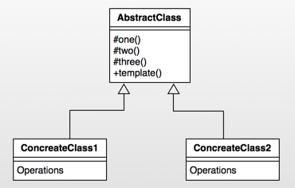
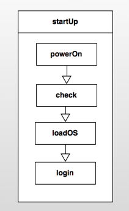
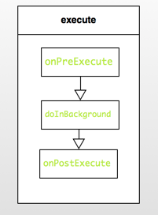

Android設計模式源碼解析之模板方法模式 
====================================
> 本文為 [Android 設計模式源碼解析](https://github.com/simple-android-framework-exchange/android_design_patterns_analysis) 中 模板方法模式 分析  
> Android系統版本： 2.3        
> 分析者：[Mr.Simple](https://github.com/bboyfeiyu)，分析狀態：完成，校對者：[Mr.Simple](https://github.com/bboyfeiyu)，校對狀態：完成   
 

## 1. 模式介紹  
 
###  模式的定義
定義一個操作中的算法的框架，而將一些步驟延遲到子類中。使得子類可以不改變一個算法的結構即可重定義該算法的某些特定步驟。


### 模式的使用場景
1. 多個子類有公有的方法，並且邏輯基本相同時。
2. 重要、複雜的算法，可以把核心算法設計為模板方法，周邊的相關細節功能則由各個子類實現。
3. 重構時，模板方法模式是一個經常使用的模式，把相同的代碼抽取到父類中，然後通過鉤子函數約束其行為。
 

## 2. UML類圖
  

### 角色介紹
* AbstractClass : 抽象類，定義了一套算法框架。 
* ConcreteClass1 : 具體實現類1；
* ConcreteClass2： 具體實現類2；


## 3. 模式的簡單實現
###  簡單實現的介紹
模板方法實際上是封裝一個算法框架，就像是一套模板一樣。而子類可以有不同的算法實現，在框架不被修改的情況下實現算法的替換。下面我們以開電腦這個動作來簡單演示一下模板方法。開電腦的整個過程都是相對穩定的，首先打開電腦電源，電腦檢測自身狀態沒有問題時將進入操作系統，對用戶進行驗證之後即可登錄電腦，下面我們使用模板方法來模擬一下這個過程。 

### 實現源碼

```java
package com.dp.example.templatemethod;

/**
 * 抽象的Computer
 * @author mrsimple
 *
 */
public abstract class AbstractComputer {

    protected void powerOn() {
        System.out.println("開啟電源");
    }

    protected void checkHardware() {
        System.out.println("硬件檢查");
    }

    protected void loadOS() {
        System.out.println("載入操作系統");
    }

    protected void login() {
        System.out.println("小白的電腦無驗證，直接進入系統");
    }

    /**
     * 啟動電腦方法, 步驟固定為開啟電源、系統檢查、加載操作系統、用戶登錄。該方法為final， 防止算法框架被覆寫.
     */
    public final void startUp() {
        System.out.println("------ 開機 START ------");
        powerOn();
        checkHardware();
        loadOS();
        login();
        System.out.println("------ 開機 END ------");
    }
}


package com.dp.example.templatemethod;

/**
 * 碼農的計算機
 * 
 * @author mrsimple
 */
public class CoderComputer extends AbstractComputer {
    @Override
    protected void login() {
        System.out.println("碼農只需要進行用戶和密碼驗證就可以了");
    }
}


package com.dp.example.templatemethod;

/**
 * 軍用計算機
 * 
 * @author mrsimple
 */
public class MilitaryComputer extends AbstractComputer {
    
 
    @Override
    protected void checkHardware() {
        super.checkHardware();
        System.out.println("檢查硬件防火牆");
    }
    
    @Override
    protected void login() {
        System.out.println("進行指紋之別等複雜的用戶驗證");
    }
}


package com.dp.example.templatemethod;

public class Test {
    public static void main(String[] args) {
        AbstractComputer comp = new CoderComputer();
        comp.startUp();

        comp = new MilitaryComputer();
        comp.startUp();

    }
}

```    

輸出結果如下 :    

```
------ 開機 START ------
開啟電源
硬件檢查
載入操作系統
碼農只需要進行用戶和密碼驗證就可以了
------ 開機 END ------
------ 開機 START ------
開啟電源
硬件檢查
檢查硬件防火牆
載入操作系統
進行指紋之別等複雜的用戶驗證
------ 開機 END ------
```
   
通過上面的例子可以看到，在startUp方法中有一些固定的步驟，依次為開啟電源、檢查硬件、加載系統、用戶登錄四個步驟，這四個步驟是電腦開機過程中不會變動的四個過程。但是不同用戶的這幾個步驟的實現可能各不相同，因此他們可以用不同的實現。而startUp為final方法，即保證了算法框架不能修改，具體算法實現卻可以靈活改變。startUp中的這幾個算法步驟我們可以稱為是一個套路，即可稱為模板方法。因此，模板方法是定義一個操作中的算法的框架，而將一些步驟延遲到子類中。使得子類可以不改變一個算法的結構即可重定義該算法的某些特定步驟。如圖 :    




## Android源碼中的模式實現
在Android中，使用了模板方法且為我們熟知的一個典型類就是AsyncTask了，關於AsyncTask的更詳細的分析請移步Android中AsyncTask的使用與源碼分析，我們這裡只分析在該類中使用的模板方法模式。     

在使用AsyncTask時，我們都有知道耗時的方法要放在doInBackground(Params... params)中，在doInBackground之前如果還想做一些類似初始化的操作可以寫在onPreExecute方法中，當doInBackground方法執行完成後，會執行onPostExecute方法，而我們只需要構建AsyncTask對象，然後執行execute方法即可。我們可以看到，它整個執行過程其實是一個框架，具體的實現都需要子類來完成。而且它執行的算法框架是固定的，調用execute後會依次執行onPreExecute,doInBackground,onPostExecute,當然你也可以通過onProgressUpdate來更新進度。我們可以簡單的理解為如下圖的模式  :
	
	   

下面我們看源碼，首先我們看執行異步任務的入口, 即execute方法 :     


```java
 public final AsyncTask<Params, Progress, Result> execute(Params... params) {
        return executeOnExecutor(sDefaultExecutor, params);
    }

    public final AsyncTask<Params, Progress, Result> executeOnExecutor(Executor exec,
            Params... params) {
        if (mStatus != Status.PENDING) {
            switch (mStatus) {
                case RUNNING:
                    throw new IllegalStateException("Cannot execute task:"
                            + " the task is already running.");
                case FINISHED:
                    throw new IllegalStateException("Cannot execute task:"
                            + " the task has already been executed "
                            + "(a task can be executed only once)");
            }
        }

        mStatus = Status.RUNNING;

        onPreExecute();

        mWorker.mParams = params;
        exec.execute(mFuture);

        return this;
    }

```

可以看到execute方法(為final類型的方法)調用了executeOnExecutor方法，在該方法中會判斷該任務的狀態，如果不是PENDING狀態則拋出異常，這也解釋了為什麼AsyncTask只能被執行一次，因此如果該任務已經被執行過的話那麼它的狀態就會變成FINISHED。繼續往下看，我們看到在executeOnExecutor方法中首先執行了onPreExecute方法，並且該方法執行在UI線程。然後將params參數傳遞給了mWorker對象的mParams字段，然後執行了exec.execute(mFuture)方法。        

mWorker和mFuture又是什麼呢？其實mWorker只是實現了Callable接口，並添加了一個參數數組字段，關於Callable和FutureTask的資料請參考[Java中的Runnable、Callable、Future、FutureTask的區別與示例](http://blog.csdn.net/bboyfeiyu/article/details/24851847)，我們挨個來分析吧，跟蹤代碼我們可以看到，這兩個字段都是在構造函數中初始化。

```java
   public AsyncTask() {
        mWorker = new WorkerRunnable<Params, Result>() {
            public Result call() throws Exception {
                mTaskInvoked.set(true);

                Process.setThreadPriority(Process.THREAD_PRIORITY_BACKGROUND);
                return postResult(doInBackground(mParams));
            }
        };

        mFuture = new FutureTask<Result>(mWorker) {
            @Override
            protected void done() {
                try {
                    final Result result = get();

                    postResultIfNotInvoked(result);
                } catch (InterruptedException e) {
                    android.util.Log.w(LOG_TAG, e);
                } catch (ExecutionException e) {
                    throw new RuntimeException("An error occured while executing doInBackground()",
                            e.getCause());
                } catch (CancellationException e) {
                    postResultIfNotInvoked(null);
                } catch (Throwable t) {
                    throw new RuntimeException("An error occured while executing "
                            + "doInBackground()", t);
                }
            }
        };
    }
```  

簡單的說就是mFuture就包裝了這個mWorker對象，會調用mWorker對象的call方法，並且將之返回給調用者。      
	關於AsyncTask的更詳細的分析請移步[Android中AsyncTask的使用與源碼分析](http://blog.csdn.net/bboyfeiyu/article/details/8973058)，我們這裡只分析模板方法模式。總之，call方法會在子線程中調用，而在call方法中又調用了doInBackground方法，因此doInBackground會執行在子線程。doInBackground會返回結果，最終通過postResult投遞給UI線程。
	我們再看看postResult的實現 :     
	
```java
    private Result postResult(Result result) {
        Message message = sHandler.obtainMessage(MESSAGE_POST_RESULT,
                new AsyncTaskResult<Result>(this, result));
        message.sendToTarget();
        return result;
    }

    private static class InternalHandler extends Handler {
        @SuppressWarnings({"unchecked", "RawUseOfParameterizedType"})
        @Override
        public void handleMessage(Message msg) {
            AsyncTaskResult result = (AsyncTaskResult) msg.obj;
            switch (msg.what) {
                case MESSAGE_POST_RESULT:
                    // There is only one result
                    result.mTask.finish(result.mData[0]);
                    break;
                case MESSAGE_POST_PROGRESS:
                    result.mTask.onProgressUpdate(result.mData);
                    break;
            }
        }
    }


    private void finish(Result result) {
        if (isCancelled()) {
            onCancelled(result);
        } else {
            onPostExecute(result);
        }
        mStatus = Status.FINISHED;
    }

```     

可以看到，postResult就是把一個消息( msg.what == MESSAGE_POST_RESULT)發送給sHandler，sHandler類型為InternalHandler類型，當InternalHandler接到MESSAGE_POST_RESULT類型的消息時就會調用result.mTask.finish(result.mData[0])方法。我們可以看到result為AsyncTaskResult類型，源碼如下  :     
   

```java
    @SuppressWarnings({"RawUseOfParameterizedType"})
    private static class AsyncTaskResult<Data> {
        final AsyncTask mTask;
        final Data[] mData;

        AsyncTaskResult(AsyncTask task, Data... data) {
            mTask = task;
            mData = data;
        }
    }
```    

**可以看到mTask就是AsyncTask對象**，調用AsyncTask對象的finish方法時又調用了onPostExecute，這個時候整個執行過程就完成了。
	總之，execute方法內部封裝了onPreExecute, doInBackground, onPostExecute這個算法框架，用戶可以根據自己的需求來在覆寫這幾個方法，使得用戶可以很方便的使用異步任務來完成耗時操作，又可以通過onPostExecute來完成更新UI線程的工作。       
	另一個比較好的模板方法示例就是Activity的聲明周期函數，例如Activity從onCreate、onStart、onResume這些程式化的執行模板，這就是一個Activity的模板方法。       

## 4. 雜談
### 優點與缺點
#### 優點  
* 封裝不變部分，擴展可變部分
* 提取公共部分代碼，便於維護

#### 缺點 
* 模板方法會帶來代碼閱讀的難度，會讓心覺得難以理解。 
